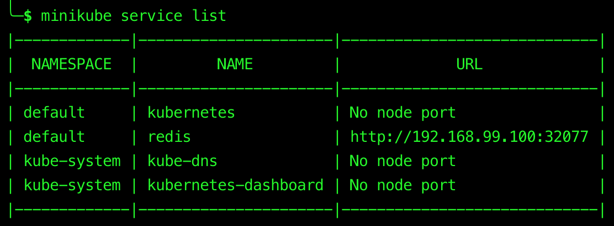

# Minikube


## Table of Contents

<!-- START doctoc generated TOC please keep comment here to allow auto update -->
<!-- DON'T EDIT THIS SECTION, INSTEAD RE-RUN doctoc TO UPDATE -->


- [minikube](#minikube)
  - [Dashboard](#dashboard)
  - [Service](#service)
- [References](#references)

<!-- END doctoc generated TOC please keep comment here to allow auto update -->

## [minikube](https://github.com/kubernetes/minikube)

> Run Kubernetes locally.

### Dashboard

```bash
minikube dashboard
```

<div align="center"></div>

### Service

- List the URLs for the services in your local cluster

```bash
minikube service list
```



- Access a service exposed via a [`NodePort`](#service-types)

	- `--url`: Display the Kubernetes service URL in the CLI instead of opening it in the default browser.

```bash
minikube service [--namespace NAMESPACE] [--url] NAME
```


minikube addons enable ingress
kubectl version --short

minikube delete
minikube cache delete
minikube start --vm-driver=virtualbox
minikube addons enable ingress
minikube ip


## References
