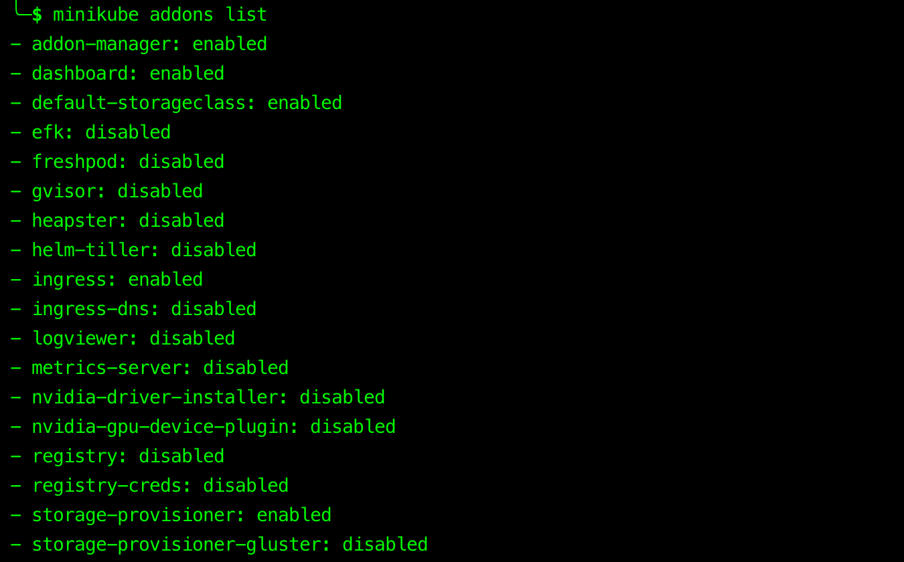

# Minikube

> Local Kubernetes, focused on application development & education.


## Table of Contents

<!-- START doctoc generated TOC please keep comment here to allow auto update -->
<!-- DON'T EDIT THIS SECTION, INSTEAD RE-RUN doctoc TO UPDATE -->


- [Addons](#addons)
- [Dashboard](#dashboard)
- [Service](#service)
- [Useful Commands](#useful-commands)
- [References](#references)

<!-- END doctoc generated TOC please keep comment here to allow auto update -->


## Addons

```bash
$ minikube addons list
```



```bash
$ minikube addons enable ingress
✅  ingress was successfully enabled
```


## Dashboard

```bash
$ minikube dashboard
```

<div align="center"></div>


## Service

- List the URLs that exposed via a [`NodePort`](https://kubernetes.io/docs/concepts/services-networking/service/#nodeport) for the services in your local cluster.

```bash
$ minikube service list
```


## Useful Commands

```bash
$ kubectl version --short
Client Version: v1.16.2
Server Version: v1.16.2
```


```bash
# Retrieve the IP address of the running cluster

$ minikube ip
192.168.99.116
```


```bash
# Log into or run a command on a machine with SSH

$ minikube ssh
                         _             _
            _         _ ( )           ( )
  ___ ___  (_)  ___  (_)| |/')  _   _ | |_      __
/' _ ` _ `\| |/' _ `\| || , <  ( ) ( )| '_`\  /'__`\
| ( ) ( ) || || ( ) || || |\`\ | (_) || |_) )(  ___/
(_) (_) (_)(_)(_) (_)(_)(_) (_)`\___/'(_,__/'`\____)

$
```


## References

- [minikube](https://github.com/kubernetes/minikube)
