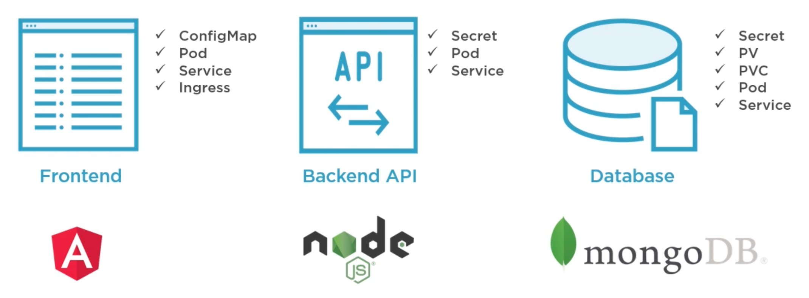

# Helm

## Table of Contents

<!-- START doctoc generated TOC please keep comment here to allow auto update -->
<!-- DON'T EDIT THIS SECTION, INSTEAD RE-RUN doctoc TO UPDATE -->

- [Course Introduction](#course-introduction)
- [Discovering HELM](#discovering-helm)
- [Installing a Local Kubernetes Cluster with Helm](#installing-a-local-kubernetes-cluster-with-helm)
- [Building Helm Charts](#building-helm-charts)
- [Customizing Charts with Helm Templates](#customizing-charts-with-helm-templates)
- [Managing Dependencies](#managing-dependencies)
- [Using Existing Helm Charts](#using-existing-helm-charts)
- [References](#references)

<!-- END doctoc generated TOC please keep comment here to allow auto update -->

## Course Introduction

## Discovering HELM

> Helm is a package manager for Kubernetes.

 

 

Helm is organized around several key concepts:
- A **chart** is a package of pre-configured Kubernetes resources.
- A **release** is a specific instance of a chart which has been deployed to the cluster using Helm.
- A **repository** is a group of published charts which can be made available to others.

Chart - It contains all of the resource definitions necessary to run an application, tool, or service inside of a Kubernetes cluster. A chart is basically a package of pre-configured Kubernetes resources.
Config - Contains configuration information that can be merged into a packaged chart to create a releasable object.
helm - Helm client. Communicates to Tiller through the Helm API - HAPI which uses gRPC.
Release - An instance of a chart running in a Kubernetes cluster.
Repository - Place where charts reside and can be shared with others.
Tiller - Helm server. It interacts directly with the Kubernetes API server to install, upgrade, query, and remove Kubernetes resources.

## Installing a Local Kubernetes Cluster with Helm

## Building Helm Charts

## Customizing Charts with Helm Templates

## Managing Dependencies

## Using Existing Helm Charts

## References

- [Packaging Applications with Helm for Kubernetes](https://app.pluralsight.com/library/courses/packaging-applications-helm-kubernetes/table-of-contents)
- [Source Code for Labs](https://github.com/phcollignon/helm)
- [Kubernetes Helm 101](https://www.aquasec.com/wiki/display/containers/Kubernetes+Helm+101)
- [IBM Helm 101](https://github.com/IBM/helm101/tree/master/tutorial)
