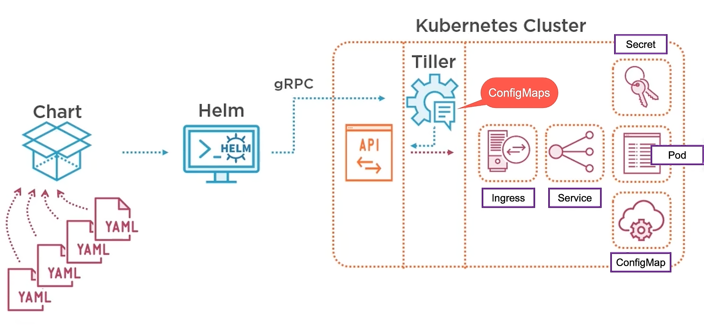

# Helm


## Table of Contents

<!-- START doctoc generated TOC please keep comment here to allow auto update -->
<!-- DON'T EDIT THIS SECTION, INSTEAD RE-RUN doctoc TO UPDATE -->


- [Overview](#overview)
- [Discovering HELM](#discovering-helm)
  - [Helm Terms](#helm-terms)
- [Installing a Local Kubernetes Cluster with Helm](#installing-a-local-kubernetes-cluster-with-helm)
- [IBM - Installing Helm on IBM Cloud Kubernetes Service](#ibm---installing-helm-on-ibm-cloud-kubernetes-service)
- [Building Helm Charts](#building-helm-charts)
- [IBM - I just want to deploy!](#ibm---i-just-want-to-deploy)
- [Customizing Charts with Helm Templates](#customizing-charts-with-helm-templates)
- [IBM - I need to change but want none of the hassle](#ibm---i-need-to-change-but-want-none-of-the-hassle)
- [Managing Dependencies](#managing-dependencies)
- [IBM - Keeping track of the deployed application](#ibm---keeping-track-of-the-deployed-application)
- [Using Existing Helm Charts](#using-existing-helm-charts)
- [IBM - I like sharing](#ibm---i-like-sharing)
- [References](#references)

<!-- END doctoc generated TOC please keep comment here to allow auto update -->


## Overview

<div align="center"></div>
<br />

<div align="center"></div>
<br />

```bash
make reset
```

```bash
$ minikube ip
192.168.99.115
```

```bash
$ cat /etc/hosts

# Lab - Guestbook Application
192.168.99.115	frontend.minikube.local
192.168.99.115	backend.minikube.local
```

<br />

```bash
$ kubectl apply --filename labs/01-without-helm/backend-secret.yaml
```

<!-- AUTO-GENERATED-CONTENT:START (CODE:src=labs/01-without-helm/backend-secret.yaml) -->
<!-- The below code snippet is automatically added from labs/01-without-helm/backend-secret.yaml -->
```yaml
---
apiVersion: v1
kind: Secret

metadata:
  name: backend-secret

data:
  # yamllint disable-line rule:line-length
  mongodb-uri: bW9uZ29kYjovL2FkbWluOnBhc3N3b3JkQG1vbmdvZGI6MjcwMTcvZ3Vlc3Rib29rP2F1dGhTb3VyY2U9YWRtaW4=
```
<!-- AUTO-GENERATED-CONTENT:END -->

<br />

```bash
$ kubectl apply --filename labs/01-without-helm/backend-service.yaml
```

<!-- AUTO-GENERATED-CONTENT:START (CODE:src=labs/01-without-helm/backend-service.yaml) -->
<!-- The below code snippet is automatically added from labs/01-without-helm/backend-service.yaml -->
```yaml
---
apiVersion: v1
kind: Service

metadata:
  name: backend
  labels:
    name: backend

spec:
  selector:
    app: backend

  ports:
    - protocol: "TCP"
      port: 80
      targetPort: 3000
```
<!-- AUTO-GENERATED-CONTENT:END -->

<br />

```bash
$ kubectl apply --filename labs/01-without-helm/backend.yaml
```

<!-- AUTO-GENERATED-CONTENT:START (CODE:src=labs/01-without-helm/backend.yaml) -->
<!-- The below code snippet is automatically added from labs/01-without-helm/backend.yaml -->
```yaml
---
apiVersion: apps/v1
kind: Deployment

metadata:
  name: backend

spec:
  replicas: 1
  selector:
    matchLabels:
      app: backend

  template:
    metadata:
      labels:
        app: backend

    spec:
      containers:
        - name: backend
          image: phico/backend:2.0
          imagePullPolicy: Always

          ports:
            - name: backend
              containerPort: 3000

          env:
            - name: MONGODB_URI
              valueFrom:
                secretKeyRef:
                  name: backend-secret
                  key: mongodb-uri
```
<!-- AUTO-GENERATED-CONTENT:END -->

```bash
$ kubectl apply --filename labs/01-without-helm/frontend-config.yaml
```

<!-- AUTO-GENERATED-CONTENT:START (CODE:src=labs/01-without-helm/frontend-config.yaml) -->
<!-- The below code snippet is automatically added from labs/01-without-helm/frontend-config.yaml -->
```yaml
---
apiVersion: v1
kind: ConfigMap

metadata:
  name: frontend-config

data:
  guestbook-name: "MyPopRock Festival 2.0"
  backend-uri: "http://backend.minikube.local/guestbook"
```
<!-- AUTO-GENERATED-CONTENT:END -->

```bash
$ kubectl apply --filename labs/01-without-helm/frontend-service.yaml
```

<!-- AUTO-GENERATED-CONTENT:START (CODE:src=labs/01-without-helm/frontend-service.yaml) -->
<!-- The below code snippet is automatically added from labs/01-without-helm/frontend-service.yaml -->
```yaml
---
apiVersion: v1
kind: Service

metadata:
  name: frontend
  labels:
    name: frontend

spec:
  selector:
    app: frontend

  ports:
    - protocol: "TCP"
      port: 80
      targetPort: 4200
```
<!-- AUTO-GENERATED-CONTENT:END -->

```bash
$ kubectl apply --filename labs/01-without-helm/frontend.yaml
```

<!-- AUTO-GENERATED-CONTENT:START (CODE:src=labs/01-without-helm/frontend.yaml) -->
<!-- The below code snippet is automatically added from labs/01-without-helm/frontend.yaml -->
```yaml
---
apiVersion: apps/v1
kind: Deployment

metadata:
  name: frontend

spec:
  replicas: 1
  selector:
    matchLabels:
      app: frontend

  template:
    metadata:
      labels:
        app: frontend

    spec:
      containers:
        - name: frontend
          image: phico/frontend:2.0
          imagePullPolicy: Always

          ports:
            - name: frontend
              containerPort: 4200

          env:
            - name: BACKEND_URI
              valueFrom:
                configMapKeyRef:
                  name: frontend-config
                  key: backend-uri

            - name: GUESTBOOK_NAME
              valueFrom:
                configMapKeyRef:
                  name: frontend-config
                  key: guestbook-name
```
<!-- AUTO-GENERATED-CONTENT:END -->

```bash
$ kubectl apply --filename labs/01-without-helm/ingress.yaml
```

<!-- AUTO-GENERATED-CONTENT:START (CODE:src=labs/01-without-helm/ingress.yaml) -->
<!-- The below code snippet is automatically added from labs/01-without-helm/ingress.yaml -->
```yaml
---
apiVersion: networking.k8s.io/v1beta1
kind: Ingress

metadata:
  name: guestbook-ingress

spec:
  rules:
    - host: frontend.minikube.local
      http:
        paths:
          - path: /
            backend:
              serviceName: frontend
              servicePort: 80

    - host: backend.minikube.local
      http:
        paths:
          - path: /
            backend:
              serviceName: backend
              servicePort: 80
```
<!-- AUTO-GENERATED-CONTENT:END -->

```bash
$ kubectl apply --filename labs/01-without-helm/mongodb-pv.yaml
```

<!-- AUTO-GENERATED-CONTENT:START (CODE:src=labs/01-without-helm/mongodb-pv.yaml) -->
<!-- The below code snippet is automatically added from labs/01-without-helm/mongodb-pv.yaml -->
```yaml
---
kind: PersistentVolume
apiVersion: v1

metadata:
  name: mongodb-pv-volume
  labels:
    type: local

spec:
  storageClassName: manual

  capacity:
    storage: 100Mi

  accessModes:
    - ReadWriteOnce

  hostPath:
    path: /mnt/data
```
<!-- AUTO-GENERATED-CONTENT:END -->

```bash
$ kubectl apply --filename labs/01-without-helm/mongodb-pvc.yaml
```

<!-- AUTO-GENERATED-CONTENT:START (CODE:src=labs/01-without-helm/mongodb-pvc.yaml) -->
<!-- The below code snippet is automatically added from labs/01-without-helm/mongodb-pvc.yaml -->
```yaml
---
apiVersion: v1
kind: PersistentVolumeClaim

metadata:
  name: mongodb-pvc

spec:
  storageClassName: manual

  accessModes:
    - ReadWriteOnce

  resources:
    requests:
      storage: 100Mi
```
<!-- AUTO-GENERATED-CONTENT:END -->

```bash
$ kubectl apply --filename labs/01-without-helm/mongodb-secret.yaml
```

<!-- AUTO-GENERATED-CONTENT:START (CODE:src=labs/01-without-helm/mongodb-secret.yaml) -->
<!-- The below code snippet is automatically added from labs/01-without-helm/mongodb-secret.yaml -->
```yaml
---
apiVersion: v1
kind: Secret

metadata:
  name: mongodb-secret

data:
  mongodb-username: YWRtaW4=
  mongodb-password: cGFzc3dvcmQ=
```
<!-- AUTO-GENERATED-CONTENT:END -->

```bash
$ kubectl apply --filename labs/01-without-helm/mongodb-service.yaml
```

<!-- AUTO-GENERATED-CONTENT:START (CODE:src=labs/01-without-helm/mongodb-service.yaml) -->
<!-- The below code snippet is automatically added from labs/01-without-helm/mongodb-service.yaml -->
```yaml
---
apiVersion: v1
kind: Service

metadata:
  name: mongodb
  labels:
    name: mongodb

spec:
  selector:
    app: mongodb

  type: NodePort

  ports:
    - name: mongodb
      port: 27017
      targetPort: 27017
```
<!-- AUTO-GENERATED-CONTENT:END -->

```bash
$ kubectl apply --filename labs/01-without-helm/mongodb.yaml
```

<!-- AUTO-GENERATED-CONTENT:START (CODE:src=labs/01-without-helm/mongodb.yaml) -->
<!-- The below code snippet is automatically added from labs/01-without-helm/mongodb.yaml -->
```yaml
---
apiVersion: apps/v1
kind: Deployment

metadata:
  name: mongodb

spec:
  replicas: 1
  selector:
    matchLabels:
      app: mongodb

  template:
    metadata:
      labels:
        app: mongodb

    spec:
      containers:
        - name: mongodb
          image: mongo

          env:
            - name: MONGO_INITDB_DATABASE
              value: guestbook
            - name: MONGO_INITDB_ROOT_USERNAME
              valueFrom:
                secretKeyRef:
                  name: mongodb-secret
                  key: mongodb-username
            - name: MONGO_INITDB_ROOT_PASSWORD
              valueFrom:
                secretKeyRef:
                  name: mongodb-secret
                  key: mongodb-password

          ports:
            - name: mongodb
              containerPort: 27017

          volumeMounts:
            - name: mongodb-volume
              mountPath: /data/db

      volumes:
        - name: mongodb-volume
          persistentVolumeClaim:
            claimName: mongodb-pvc
```
<!-- AUTO-GENERATED-CONTENT:END -->


## Discovering HELM

> Helm is a package manager for Kubernetes.

<div align="center"></div>
<br />

<div align="center"></div>
<br />

### Helm Terms

- Chart: It contains all of the resource definitions necessary to run an application, tool, or service inside of a Kubernetes cluster. A chart is basically a package of pre-configured Kubernetes resources.
- Config: Contains configuration information that can be merged into a packaged chart to create a releasable object.
- helm: Helm client. Communicates to Tiller through the Helm API - HAPI which uses gRPC.
The Helm API (HAPI)
- Release: An instance of a chart running in a Kubernetes cluster.
- Repository: Place where charts reside and can be shared with others.
- Tiller: Helm server. It interacts directly with the Kubernetes API server to install, upgrade, query, and remove Kubernetes resources.

Helm is organized around several key concepts:
- A **chart** is a package of pre-configured Kubernetes resources.
- A **release** is a specific instance of a chart which has been deployed to the cluster using Helm.
- A **repository** is a group of published charts which can be made available to others.

- **The Helm Client** is a command-line client for end users.
- **The Tiller Server** is an in-cluster server that interacts with the Helm client, and interfaces with the Kubernetes API server.


## Installing a Local Kubernetes Cluster with Helm

## IBM - Installing Helm on IBM Cloud Kubernetes Service


## Building Helm Charts

## IBM - I just want to deploy!


## Customizing Charts with Helm Templates

## IBM - I need to change but want none of the hassle


## Managing Dependencies

## IBM - Keeping track of the deployed application


## Using Existing Helm Charts

## IBM - I like sharing


## References

- [Packaging Applications with Helm for Kubernetes](https://app.pluralsight.com/library/courses/packaging-applications-helm-kubernetes/table-of-contents)
- [Source Code for Labs](https://github.com/phcollignon/helm)
- [IBM Helm 101](https://github.com/IBM/helm101/tree/master/tutorial)
- [Kubernetes Helm 101](https://www.aquasec.com/wiki/display/containers/Kubernetes+Helm+101)
