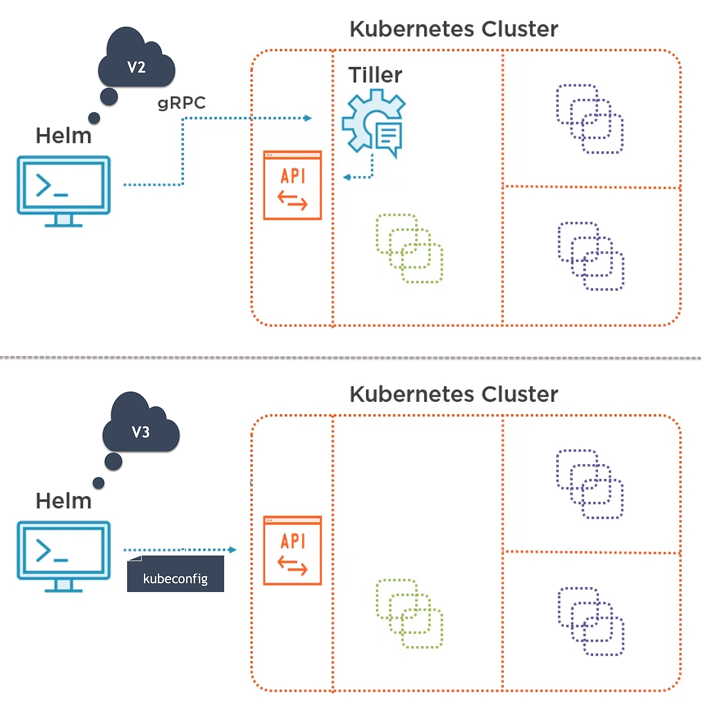
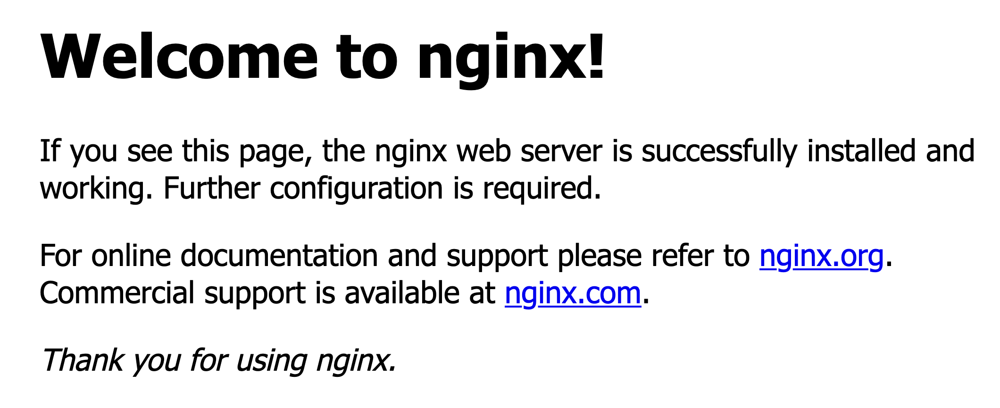

# Helm


## Table of Contents

<!-- START doctoc generated TOC please keep comment here to allow auto update -->
<!-- DON'T EDIT THIS SECTION, INSTEAD RE-RUN doctoc TO UPDATE -->


- [Overview](#overview)
- [Discovering Helm](#discovering-helm)
- [Helm 3 Fundamentals](#helm-3-fundamentals)
  - [Install a Chart](#install-a-chart)
  - [Storage Driver](#storage-driver)
  - [Create a Chart](#create-a-chart)
  - [Chart Template](#chart-template)
  - [Chart Tests](#chart-tests)
- [-------------------------------------------------------------](#-------------------------------------------------------------)
- [Pluralsight - Building Helm Charts](#pluralsight---building-helm-charts)
- [IBM - I just want to deploy!](#ibm---i-just-want-to-deploy)
- [Pluralsight - Customizing Charts with Helm Templates](#pluralsight---customizing-charts-with-helm-templates)
- [IBM - I need to change but want none of the hassle](#ibm---i-need-to-change-but-want-none-of-the-hassle)
- [Pluralsight - Managing Dependencies](#pluralsight---managing-dependencies)
- [IBM - Keeping track of the deployed application](#ibm---keeping-track-of-the-deployed-application)
- [Pluralsight - Using Existing Helm Charts](#pluralsight---using-existing-helm-charts)
- [IBM - I like sharing](#ibm---i-like-sharing)
- [References](#references)

<!-- END doctoc generated TOC please keep comment here to allow auto update -->


## Overview

<div align="center"></div>
<br />

<div align="center"></div>
<br />

```bash
$ minikube ip
192.168.99.100
```

```bash
$ cat /etc/hosts

# Experiment - Minikube
192.168.99.100	frontend.minikube.local
192.168.99.100	backend.minikube.local
```

<!-- AUTO-GENERATED-CONTENT:START (CODE:src=labs/01-without-helm/apply.sh) -->
<!-- The below code snippet is automatically added from labs/01-without-helm/apply.sh -->
```sh
#!/usr/bin/env bash
set -eoux pipefail

# Database
kubectl apply --filename labs/01-without-helm/mongodb-secret.yaml
kubectl apply --filename labs/01-without-helm/mongodb-pv.yaml
kubectl apply --filename labs/01-without-helm/mongodb-pvc.yaml
kubectl apply --filename labs/01-without-helm/mongodb-deployment.yaml
kubectl apply --filename labs/01-without-helm/mongodb-service.yaml

# Backend API
kubectl apply --filename labs/01-without-helm/backend-secret.yaml
kubectl apply --filename labs/01-without-helm/backend-deployment.yaml
kubectl apply --filename labs/01-without-helm/backend-service.yaml

# Frontend
kubectl apply --filename labs/01-without-helm/frontend-config.yaml
kubectl apply --filename labs/01-without-helm/frontend-deployment.yaml
kubectl apply --filename labs/01-without-helm/frontend-service.yaml
kubectl apply --filename labs/01-without-helm/ingress.yaml
```
<!-- AUTO-GENERATED-CONTENT:END -->

```bash
$ labs/01-without-helm/apply.sh
+ kubectl apply --filename labs/01-without-helm/mongodb-secret.yaml
secret/mongodb-secret created
+ kubectl apply --filename labs/01-without-helm/mongodb-pv.yaml
persistentvolume/mongodb-pv created
+ kubectl apply --filename labs/01-without-helm/mongodb-pvc.yaml
persistentvolumeclaim/mongodb-pvc created
+ kubectl apply --filename labs/01-without-helm/mongodb-deployment.yaml
deployment.apps/mongodb created
+ kubectl apply --filename labs/01-without-helm/mongodb-service.yaml
service/mongodb created
+ kubectl apply --filename labs/01-without-helm/backend-secret.yaml
secret/backend-secret created
+ kubectl apply --filename labs/01-without-helm/backend-deployment.yaml
deployment.apps/backend created
+ kubectl apply --filename labs/01-without-helm/backend-service.yaml
service/backend created
+ kubectl apply --filename labs/01-without-helm/frontend-config.yaml
configmap/frontend-config created
+ kubectl apply --filename labs/01-without-helm/frontend-deployment.yaml
deployment.apps/frontend created
+ kubectl apply --filename labs/01-without-helm/frontend-service.yaml
service/frontend created
+ kubectl apply --filename labs/01-without-helm/ingress.yaml
ingress.networking.k8s.io/guestbook-ingress created
```

<br />

<!-- AUTO-GENERATED-CONTENT:START (CODE:src=labs/01-without-helm/mongodb-secret.yaml) -->
<!-- The below code snippet is automatically added from labs/01-without-helm/mongodb-secret.yaml -->
```yaml
# Filename: labs/01-without-helm/mongodb-secret.yaml
---
apiVersion: v1
kind: Secret

metadata:
  name: mongodb-secret

data:
  mongodb-username: YWRtaW4=
  mongodb-password: cGFzc3dvcmQ=
```
<!-- AUTO-GENERATED-CONTENT:END -->

<!-- AUTO-GENERATED-CONTENT:START (CODE:src=labs/01-without-helm/mongodb-pv.yaml) -->
<!-- The below code snippet is automatically added from labs/01-without-helm/mongodb-pv.yaml -->
```yaml
# Filename: labs/01-without-helm/mongodb-pv.yaml
---
kind: PersistentVolume
apiVersion: v1

metadata:
  name: mongodb-pv
  labels:
    type: local

spec:
  storageClassName: manual

  capacity:
    storage: 100Mi

  accessModes:
    - ReadWriteOnce

  hostPath:
    path: /mnt/data
```
<!-- AUTO-GENERATED-CONTENT:END -->

<!-- AUTO-GENERATED-CONTENT:START (CODE:src=labs/01-without-helm/mongodb-pvc.yaml) -->
<!-- The below code snippet is automatically added from labs/01-without-helm/mongodb-pvc.yaml -->
```yaml
# Filename: labs/01-without-helm/mongodb-pvc.yaml
---
apiVersion: v1
kind: PersistentVolumeClaim

metadata:
  name: mongodb-pvc

spec:
  storageClassName: manual

  accessModes:
    - ReadWriteOnce

  resources:
    requests:
      storage: 100Mi
```
<!-- AUTO-GENERATED-CONTENT:END -->

<!-- AUTO-GENERATED-CONTENT:START (CODE:src=labs/01-without-helm/mongodb-deployment.yaml) -->
<!-- The below code snippet is automatically added from labs/01-without-helm/mongodb-deployment.yaml -->
```yaml
# Filename: labs/01-without-helm/mongodb-deployment.yaml
---
apiVersion: apps/v1
kind: Deployment

metadata:
  name: mongodb

spec:
  replicas: 1
  selector:
    matchLabels:
      app: mongodb

  template:
    metadata:
      labels:
        app: mongodb

    spec:
      containers:
        - name: mongodb
          image: mongo

          env:
            - name: MONGO_INITDB_DATABASE
              value: guestbook

            - name: MONGO_INITDB_ROOT_USERNAME
              valueFrom:
                secretKeyRef:
                  name: mongodb-secret
                  key: mongodb-username

            - name: MONGO_INITDB_ROOT_PASSWORD
              valueFrom:
                secretKeyRef:
                  name: mongodb-secret
                  key: mongodb-password

          ports:
            - name: mongodb
              containerPort: 27017

          volumeMounts:
            - name: data-volume
              mountPath: /data/db

      volumes:
        - name: data-volume
          persistentVolumeClaim:
            claimName: mongodb-pvc
```
<!-- AUTO-GENERATED-CONTENT:END -->

<!-- AUTO-GENERATED-CONTENT:START (CODE:src=labs/01-without-helm/mongodb-service.yaml) -->
<!-- The below code snippet is automatically added from labs/01-without-helm/mongodb-service.yaml -->
```yaml
# Filename: labs/01-without-helm/mongodb-service.yaml
---
apiVersion: v1
kind: Service

metadata:
  name: mongodb
  labels:
    name: mongodb

spec:
  selector:
    app: mongodb

  type: NodePort

  ports:
    - name: mongodb
      port: 27017
      targetPort: 27017

      # Port on each Node on which this Service is exposed
      nodePort: 31111
      # $ minikube service list
```
<!-- AUTO-GENERATED-CONTENT:END -->

<br />

<!-- AUTO-GENERATED-CONTENT:START (CODE:src=labs/01-without-helm/backend-secret.yaml) -->
<!-- The below code snippet is automatically added from labs/01-without-helm/backend-secret.yaml -->
```yaml
# Filename: labs/01-without-helm/backend-secret.yaml
---
apiVersion: v1
kind: Secret

metadata:
  name: backend-secret

data:
  # yamllint disable-line rule:line-length
  mongodb-uri: bW9uZ29kYjovL2FkbWluOnBhc3N3b3JkQG1vbmdvZGI6MjcwMTcvZ3Vlc3Rib29rP2F1dGhTb3VyY2U9YWRtaW4=
```
<!-- AUTO-GENERATED-CONTENT:END -->

<!-- AUTO-GENERATED-CONTENT:START (CODE:src=labs/01-without-helm/backend-deployment.yaml) -->
<!-- The below code snippet is automatically added from labs/01-without-helm/backend-deployment.yaml -->
```yaml
# Filename: labs/01-without-helm/backend-deployment.yaml
---
apiVersion: apps/v1
kind: Deployment

metadata:
  name: backend

spec:
  replicas: 1
  selector:
    matchLabels:
      app: backend

  template:
    metadata:
      labels:
        app: backend

    spec:
      containers:
        - name: backend
          image: phico/backend:2.0
          imagePullPolicy: Always

          ports:
            - name: backend
              containerPort: 3000

          env:
            - name: MONGODB_URI
              valueFrom:
                secretKeyRef:
                  name: backend-secret
                  key: mongodb-uri
```
<!-- AUTO-GENERATED-CONTENT:END -->

<!-- AUTO-GENERATED-CONTENT:START (CODE:src=labs/01-without-helm/backend-service.yaml) -->
<!-- The below code snippet is automatically added from labs/01-without-helm/backend-service.yaml -->
```yaml
# Filename: labs/01-without-helm/backend-service.yaml
---
apiVersion: v1
kind: Service

metadata:
  name: backend
  labels:
    name: backend

spec:
  selector:
    app: backend

  ports:
    - protocol: "TCP"
      port: 80
      targetPort: 3000
```
<!-- AUTO-GENERATED-CONTENT:END -->

<br />

<!-- AUTO-GENERATED-CONTENT:START (CODE:src=labs/01-without-helm/frontend-config.yaml) -->
<!-- The below code snippet is automatically added from labs/01-without-helm/frontend-config.yaml -->
```yaml
# Filename: labs/01-without-helm/frontend-config.yaml
---
apiVersion: v1
kind: ConfigMap

metadata:
  name: frontend-config

data:
  guestbook-name: "MyPopRock Festival 2.0"
  backend-uri: "http://backend.minikube.local/guestbook"
```
<!-- AUTO-GENERATED-CONTENT:END -->

<!-- AUTO-GENERATED-CONTENT:START (CODE:src=labs/01-without-helm/frontend-deployment.yaml) -->
<!-- The below code snippet is automatically added from labs/01-without-helm/frontend-deployment.yaml -->
```yaml
# Filename: labs/01-without-helm/frontend-deployment.yaml
---
apiVersion: apps/v1
kind: Deployment

metadata:
  name: frontend

spec:
  replicas: 1
  selector:
    matchLabels:
      app: frontend

  template:
    metadata:
      labels:
        app: frontend

    spec:
      containers:
        - name: frontend
          image: phico/frontend:2.0
          imagePullPolicy: Always

          ports:
            - name: frontend
              containerPort: 4200

          env:
            - name: GUESTBOOK_NAME
              valueFrom:
                configMapKeyRef:
                  name: frontend-config
                  key: guestbook-name

            - name: BACKEND_URI
              valueFrom:
                configMapKeyRef:
                  name: frontend-config
                  key: backend-uri
```
<!-- AUTO-GENERATED-CONTENT:END -->

<!-- AUTO-GENERATED-CONTENT:START (CODE:src=labs/01-without-helm/frontend-service.yaml) -->
<!-- The below code snippet is automatically added from labs/01-without-helm/frontend-service.yaml -->
```yaml
# Filename: labs/01-without-helm/frontend-service.yaml
---
apiVersion: v1
kind: Service

metadata:
  name: frontend
  labels:
    name: frontend

spec:
  selector:
    app: frontend

  ports:
    - protocol: "TCP"
      port: 80
      targetPort: 4200
```
<!-- AUTO-GENERATED-CONTENT:END -->

<!-- AUTO-GENERATED-CONTENT:START (CODE:src=labs/01-without-helm/ingress.yaml) -->
<!-- The below code snippet is automatically added from labs/01-without-helm/ingress.yaml -->
```yaml
# Filename: labs/01-without-helm/ingress.yaml
---
apiVersion: networking.k8s.io/v1beta1
kind: Ingress

metadata:
  name: guestbook-ingress

spec:
  rules:
    - host: frontend.minikube.local
      http:
        paths:
          - path: /
            backend:
              serviceName: frontend
              servicePort: 80

    - host: backend.minikube.local
      http:
        paths:
          - path: /
            backend:
              serviceName: backend
              servicePort: 80
```
<!-- AUTO-GENERATED-CONTENT:END -->


## Discovering Helm

> Helm is a package manager for Kubernetes.

<div align="center"></div>
<br />

<div align="center"></div>
<br />

- **Helm client**: a command-line client for end users.
It communicates to **Tiller** through the **Helm API** (HAPI) which uses **gRPC**.

- **Tiller server**: an in-cluster server that interacts with the **Helm client**,
and interfaces with the **Kubernetes API server**.
It interacts directly with the **Kubernetes API server**
to install, upgrade, query, and remove Kubernetes resources.

<div align="center"></div>
<br />

- **Chart**: contains all of the resource definitions necessary to run
an application, tool, or service inside of a Kubernetes cluster.
In short, a **Chart** is basically a package of pre-configured Kubernetes resources.

```
# Helm 3 - Chart File Structure
.
├── Chart.yaml          # A YAML file containing information about the chart
├── LICENSE             # A plain text file containing the license for the chart
├── README.md           # A human-readable README file
├── values.yaml         # The default configuration values for this chart
├── values.schema.json  # A JSON Schema for imposing a structure on the values.yaml file
├── charts/             # A directory containing any charts upon which this chart depends
├── crds/               # Custom Resource Definitions
├── templates/          # A directory of templates that, when combined with values,
|                       # will generate valid Kubernetes manifest files
├── templates/NOTES.txt # A plain text file containing short usage notes
```

- **Release**: a specific instance of a **Chart** which has been deployed to the Kubernetes cluster using **Helm**.

- **Repository**: a place where published **Charts** reside and can be shared with others.


## Helm 3 Fundamentals

<div align="center"></div>
<br />

```bash
$ helm version --short
v3.0.0+ge29ce2a
```

```bash
# Help for helm
$ helm --help
```


### Install a Chart

```bash
# Interact with chart repositories

$ helm repo list
NAME   	URL
bitnami	https://charts.bitnami.com/bitnami

$ helm repo remove bitnami
"bitnami" has been removed from your repositories

$ helm repo add bitnami https://charts.bitnami.com/bitnami
"bitnami" has been added to your repositories
```

```bash
# Update information of available charts locally from chart repositories
$ helm repo update
Hang tight while we grab the latest from your chart repositories...
...Successfully got an update from the "bitnami" chart repository
Update Complete. ⎈ Happy Helming!⎈

# Search for Helm charts in repositories
$ helm search repo bitnami/nginx
NAME                            	CHART VERSION	APP VERSION	DESCRIPTION
bitnami/nginx                   	5.0.0        	1.16.1     	Chart for the nginx server
bitnami/nginx-ingress-controller	5.2.0        	0.26.1     	Chart for the nginx Ingress controller

# Install a chart
$ helm install bitnami-nginx bitnami/nginx
NAME: bitnami-nginx
LAST DEPLOYED: Tue Nov 26 12:09:20 2019
NAMESPACE: default
STATUS: deployed
REVISION: 1
TEST SUITE: None
NOTES:
Get the NGINX URL:

  NOTE: It may take a few minutes for the LoadBalancer IP to be available.
        Watch the status with: 'kubectl get svc --namespace default -w bitnami-nginx'

  export SERVICE_IP=$(kubectl get svc --namespace default bitnami-nginx --template "{{ range (index .status.loadBalancer.ingress 0) }}{{.}}{{ end }}")
  echo "NGINX URL: http://$SERVICE_IP/"

# List all of the releases
$ helm list
NAME         	NAMESPACE	REVISION	UPDATED                             	STATUS  	CHART      	APP VERSION
bitnami-nginx	default  	1       	2019-11-26 12:09:20.019685 +0700 +07	deployed	nginx-5.0.0	1.16.1
```

```bash
$ kubectl get services
NAME            TYPE           CLUSTER-IP      EXTERNAL-IP   PORT(S)                      AGE
bitnami-nginx   LoadBalancer   10.107.69.168   <pending>     80:30584/TCP,443:31806/TCP   111s
kubernetes      ClusterIP      10.96.0.1       <none>        443/TCP                      41m
```

- Open [http://192.168.99.100:30584](http://192.168.99.100:30584)



```bash
$ kubectl get secrets --show-labels
NAME                                  TYPE                                  DATA   AGE    LABELS
default-token-m668f                   kubernetes.io/service-account-token   3      109m   <none>
sh.helm.release.v1.bitnami-nginx.v1   helm.sh/release.v1                    1      86s    modifiedAt=1575593879,name=bitnami-nginx,owner=helm,status=deployed,version=1
```

```bash
# Uninstall a release
$ helm uninstall bitnami-nginx
release "bitnami-nginx" uninstalled

$ helm list
NAME	NAMESPACE	REVISION	UPDATED	STATUS	CHART	APP VERSION
```


### Storage Driver

The storage is changed in Helm 3 as follows:

- Releases are stored as Secrets by default.
- Storage is in the namespace of the release.
- Naming is changed to `sh.helm.release.v1.<release_name>.v<revision_version>`.
- The Secret type is set as `helm.sh/release.v1`.
- Labels changed from the Helm 2 ConfigMap/Secret.
- Due to changes in the underlying internals,
the Release object stored in data.release differs from the Helm 2 Release object.


### Create a Chart

```bash
# Create a chart directory along with the common files and directories used in a chart
$ rm -rf labs/nginx-demo && helm create labs/nginx-demo
Creating labs/nginx-demo
```

```bash
$ tree -a labs/nginx-demo
labs/nginx-demo
├── .helmignore
├── Chart.yaml
├── charts
├── templates
│   ├── NOTES.txt
│   ├── _helpers.tpl
│   ├── deployment.yaml
│   ├── ingress.yaml
│   ├── service.yaml
│   ├── serviceaccount.yaml
│   └── tests
│       └── test-connection.yaml
└── values.yaml

3 directories, 10 files
```

<!-- AUTO-GENERATED-CONTENT:START (CODE:src=labs/nginx-demo/.helmignore) -->
<!-- The below code snippet is automatically added from labs/nginx-demo/.helmignore -->
```
# Patterns to ignore when building packages.
# This supports shell glob matching, relative path matching, and
# negation (prefixed with !). Only one pattern per line.
.DS_Store
# Common VCS dirs
.git/
.gitignore
.bzr/
.bzrignore
.hg/
.hgignore
.svn/
# Common backup files
*.swp
*.bak
*.tmp
*~
# Various IDEs
.project
.idea/
*.tmproj
.vscode/
```
<!-- AUTO-GENERATED-CONTENT:END -->

<!-- AUTO-GENERATED-CONTENT:START (CODE:src=labs/nginx-demo/Chart.yaml) -->
<!-- The below code snippet is automatically added from labs/nginx-demo/Chart.yaml -->
```yaml
apiVersion: v2
name: nginx-demo
description: A Helm chart for Kubernetes

# A chart can be either an 'application' or a 'library' chart.
#
# Application charts are a collection of templates that can be packaged into versioned archives
# to be deployed.
#
# Library charts provide useful utilities or functions for the chart developer. They're included as
# a dependency of application charts to inject those utilities and functions into the rendering
# pipeline. Library charts do not define any templates and therefore cannot be deployed.
type: application

# This is the chart version. This version number should be incremented each time you make changes
# to the chart and its templates, including the app version.
version: 0.1.0

# This is the version number of the application being deployed. This version number should be
# incremented each time you make changes to the application.
appVersion: 1.16.0
```
<!-- AUTO-GENERATED-CONTENT:END -->

<!-- AUTO-GENERATED-CONTENT:START (CODE:src=labs/nginx-demo/values.yaml) -->
<!-- The below code snippet is automatically added from labs/nginx-demo/values.yaml -->
```yaml
# Default values for nginx-demo.
# This is a YAML-formatted file.
# Declare variables to be passed into your templates.

replicaCount: 1

image:
  repository: nginx
  pullPolicy: IfNotPresent

imagePullSecrets: []
nameOverride: ""
fullnameOverride: ""

serviceAccount:
  # Specifies whether a service account should be created
  create: true
  # The name of the service account to use.
  # If not set and create is true, a name is generated using the fullname template
  name:

podSecurityContext: {}
  # fsGroup: 2000

securityContext: {}
  # capabilities:
  #   drop:
  #   - ALL
  # readOnlyRootFilesystem: true
  # runAsNonRoot: true
  # runAsUser: 1000

service:
  type: ClusterIP
  port: 80

ingress:
  enabled: false
  annotations: {}
    # kubernetes.io/ingress.class: nginx
    # kubernetes.io/tls-acme: "true"
  hosts:
    - host: chart-example.local
      paths: []
  tls: []
  #  - secretName: chart-example-tls
  #    hosts:
  #      - chart-example.local

resources: {}
  # We usually recommend not to specify default resources and to leave this as a conscious
  # choice for the user. This also increases chances charts run on environments with little
  # resources, such as Minikube. If you do want to specify resources, uncomment the following
  # lines, adjust them as necessary, and remove the curly braces after 'resources:'.
  # limits:
  #   cpu: 100m
  #   memory: 128Mi
  # requests:
  #   cpu: 100m
  #   memory: 128Mi

nodeSelector: {}

tolerations: []

affinity: {}
```
<!-- AUTO-GENERATED-CONTENT:END -->

<!-- AUTO-GENERATED-CONTENT:START (CODE:src=labs/nginx-demo/templates/NOTES.txt) -->
<!-- The below code snippet is automatically added from labs/nginx-demo/templates/NOTES.txt -->
```txt
1. Get the application URL by running these commands:
{{- if .Values.ingress.enabled }}
{{- range $host := .Values.ingress.hosts }}
  {{- range .paths }}
  http{{ if $.Values.ingress.tls }}s{{ end }}://{{ $host.host }}{{ . }}
  {{- end }}
{{- end }}
{{- else if contains "NodePort" .Values.service.type }}
  export NODE_PORT=$(kubectl get --namespace {{ .Release.Namespace }} -o jsonpath="{.spec.ports[0].nodePort}" services {{ include "nginx-demo.fullname" . }})
  export NODE_IP=$(kubectl get nodes --namespace {{ .Release.Namespace }} -o jsonpath="{.items[0].status.addresses[0].address}")
  echo http://$NODE_IP:$NODE_PORT
{{- else if contains "LoadBalancer" .Values.service.type }}
     NOTE: It may take a few minutes for the LoadBalancer IP to be available.
           You can watch the status of by running 'kubectl get --namespace {{ .Release.Namespace }} svc -w {{ include "nginx-demo.fullname" . }}'
  export SERVICE_IP=$(kubectl get svc --namespace {{ .Release.Namespace }} {{ include "nginx-demo.fullname" . }} --template "{{"{{ range (index .status.loadBalancer.ingress 0) }}{{.}}{{ end }}"}}")
  echo http://$SERVICE_IP:{{ .Values.service.port }}
{{- else if contains "ClusterIP" .Values.service.type }}
  export POD_NAME=$(kubectl get pods --namespace {{ .Release.Namespace }} -l "app.kubernetes.io/name={{ include "nginx-demo.name" . }},app.kubernetes.io/instance={{ .Release.Name }}" -o jsonpath="{.items[0].metadata.name}")
  echo "Visit http://127.0.0.1:8080 to use your application"
  kubectl --namespace {{ .Release.Namespace }} port-forward $POD_NAME 8080:80
{{- end }}
```
<!-- AUTO-GENERATED-CONTENT:END -->

```bash
# Run a series of tests to verify that the chart is well-formed
$ helm lint labs/nginx-demo
==> Linting labs/nginx-demo
[INFO] Chart.yaml: icon is recommended

1 chart(s) linted, 0 chart(s) failed
```

```bash
$ helm list
NAME	NAMESPACE	REVISION	UPDATED	STATUS	CHART	APP VERSION

$ helm install labs/nginx-demo --generate-name
NAME: nginx-demo-1574745926
LAST DEPLOYED: Tue Nov 26 12:25:27 2019
NAMESPACE: default
STATUS: deployed
REVISION: 1
NOTES:
1. Get the application URL by running these commands:
  export POD_NAME=$(kubectl get pods --namespace default -l "app.kubernetes.io/name=nginx-demo,app.kubernetes.io/instance=nginx-demo-1574745926" -o jsonpath="{.items[0].metadata.name}")
  echo "Visit http://127.0.0.1:8080 to use your application"
  kubectl --namespace default port-forward $POD_NAME 8080:80

$ helm list
NAME                 	NAMESPACE	REVISION	UPDATED                             	STATUS  	CHART           	APP VERSION
nginx-demo-1574745926	default  	1       	2019-11-26 12:25:27.334981 +0700 +07	deployed	nginx-demo-0.1.0	1.16.0
```

<br />

```bash
# Render chart templates locally
$ helm template labs/nginx-demo > labs/nginx-demo.yaml
```

<!-- AUTO-GENERATED-CONTENT:START (CODE:src=labs/nginx-demo.yaml) -->
<!-- The below code snippet is automatically added from labs/nginx-demo.yaml -->
```yaml
---
# Source: nginx-demo/templates/serviceaccount.yaml
apiVersion: v1
kind: ServiceAccount
metadata:
  name: RELEASE-NAME-nginx-demo
  labels:

    helm.sh/chart: nginx-demo-0.1.0
    app.kubernetes.io/name: nginx-demo
    app.kubernetes.io/instance: RELEASE-NAME
    app.kubernetes.io/version: "1.16.0"
    app.kubernetes.io/managed-by: Helm
---
# Source: nginx-demo/templates/service.yaml
apiVersion: v1
kind: Service
metadata:
  name: RELEASE-NAME-nginx-demo
  labels:
    helm.sh/chart: nginx-demo-0.1.0
    app.kubernetes.io/name: nginx-demo
    app.kubernetes.io/instance: RELEASE-NAME
    app.kubernetes.io/version: "1.16.0"
    app.kubernetes.io/managed-by: Helm
spec:
  type: ClusterIP
  ports:
    - port: 80
      targetPort: http
      protocol: TCP
      name: http
  selector:
    app.kubernetes.io/name: nginx-demo
    app.kubernetes.io/instance: RELEASE-NAME
---
# Source: nginx-demo/templates/deployment.yaml
apiVersion: apps/v1
kind: Deployment
metadata:
  name: RELEASE-NAME-nginx-demo
  labels:
    helm.sh/chart: nginx-demo-0.1.0
    app.kubernetes.io/name: nginx-demo
    app.kubernetes.io/instance: RELEASE-NAME
    app.kubernetes.io/version: "1.16.0"
    app.kubernetes.io/managed-by: Helm
spec:
  replicas: 1
  selector:
    matchLabels:
      app.kubernetes.io/name: nginx-demo
      app.kubernetes.io/instance: RELEASE-NAME
  template:
    metadata:
      labels:
        app.kubernetes.io/name: nginx-demo
        app.kubernetes.io/instance: RELEASE-NAME
    spec:
      serviceAccountName: RELEASE-NAME-nginx-demo
      securityContext:
        {}
      containers:
        - name: nginx-demo
          securityContext:
            {}
          image: "nginx:1.16.0"
          imagePullPolicy: IfNotPresent
          ports:
            - name: http
              containerPort: 80
              protocol: TCP
          livenessProbe:
            httpGet:
              path: /
              port: http
          readinessProbe:
            httpGet:
              path: /
              port: http
          resources:
            {}
---
# Source: nginx-demo/templates/tests/test-connection.yaml
apiVersion: v1
kind: Pod
metadata:
  name: "RELEASE-NAME-nginx-demo-test-connection"
  labels:

    helm.sh/chart: nginx-demo-0.1.0
    app.kubernetes.io/name: nginx-demo
    app.kubernetes.io/instance: RELEASE-NAME
    app.kubernetes.io/version: "1.16.0"
    app.kubernetes.io/managed-by: Helm
  annotations:
    "helm.sh/hook": test-success
spec:
  containers:
    - name: wget
      image: busybox
      command: ['wget']
      args:  ['RELEASE-NAME-nginx-demo:80']
  restartPolicy: Never
```
<!-- AUTO-GENERATED-CONTENT:END -->


```bash
$ kubectl get all | grep nginx-demo
pod/nginx-demo-1574745926-679d8678f9-xjp9p   1/1     Running     0          7m1s
pod/nginx-demo-1574745926-test-connection    0/1     Completed   0          5m36s
service/nginx-demo-1574745926   ClusterIP   10.97.50.0   <none>        80/TCP    7m1s
deployment.apps/nginx-demo-1574745926   1/1     1            1           7m1s
replicaset.apps/nginx-demo-1574745926-679d8678f9   1         1         1       7m1s
```

```bash
$ helm list
NAME                 	NAMESPACE	REVISION	UPDATED                             	STATUS  	CHART           	APP VERSION
nginx-demo-1574745926	default  	1       	2019-11-26 12:25:27.334981 +0700 +07	deployed	nginx-demo-0.1.0	1.16.0

# Show the status of a named release
$ helm status nginx-demo-1574745926
NAME: nginx-demo-1574745926
LAST DEPLOYED: Tue Nov 26 12:25:27 2019
NAMESPACE: default
STATUS: deployed
REVISION: 1
TEST SUITE:     nginx-demo-1574745926-test-connection
Last Started:   Tue Nov 26 12:26:52 2019
Last Completed: Tue Nov 26 12:26:59 2019
Phase:          Succeeded
NOTES:
1. Get the application URL by running these commands:
  export POD_NAME=$(kubectl get pods --namespace default -l "app.kubernetes.io/name=nginx-demo,app.kubernetes.io/instance=nginx-demo-1574745926" -o jsonpath="{.items[0].metadata.name}")
  echo "Visit http://127.0.0.1:8080 to use your application"
  kubectl --namespace default port-forward $POD_NAME 8080:80
```

### Chart Template

- `.tpl`: Template helpers.
- `.yaml`: Kubernetes manifests.

<!-- AUTO-GENERATED-CONTENT:START (CODE:src=labs/nginx-demo/templates/_helpers.tpl) -->
<!-- The below code snippet is automatically added from labs/nginx-demo/templates/_helpers.tpl -->
```tpl
{{/* vim: set filetype=mustache: */}}
{{/*
Expand the name of the chart.
*/}}
{{- define "nginx-demo.name" -}}
{{- default .Chart.Name .Values.nameOverride | trunc 63 | trimSuffix "-" -}}
{{- end -}}

{{/*
Create a default fully qualified app name.
We truncate at 63 chars because some Kubernetes name fields are limited to this (by the DNS naming spec).
If release name contains chart name it will be used as a full name.
*/}}
{{- define "nginx-demo.fullname" -}}
{{- if .Values.fullnameOverride -}}
{{- .Values.fullnameOverride | trunc 63 | trimSuffix "-" -}}
{{- else -}}
{{- $name := default .Chart.Name .Values.nameOverride -}}
{{- if contains $name .Release.Name -}}
{{- .Release.Name | trunc 63 | trimSuffix "-" -}}
{{- else -}}
{{- printf "%s-%s" .Release.Name $name | trunc 63 | trimSuffix "-" -}}
{{- end -}}
{{- end -}}
{{- end -}}

{{/*
Create chart name and version as used by the chart label.
*/}}
{{- define "nginx-demo.chart" -}}
{{- printf "%s-%s" .Chart.Name .Chart.Version | replace "+" "_" | trunc 63 | trimSuffix "-" -}}
{{- end -}}

{{/*
Common labels
*/}}
{{- define "nginx-demo.labels" -}}
helm.sh/chart: {{ include "nginx-demo.chart" . }}
{{ include "nginx-demo.selectorLabels" . }}
{{- if .Chart.AppVersion }}
app.kubernetes.io/version: {{ .Chart.AppVersion | quote }}
{{- end }}
app.kubernetes.io/managed-by: {{ .Release.Service }}
{{- end -}}

{{/*
Selector labels
*/}}
{{- define "nginx-demo.selectorLabels" -}}
app.kubernetes.io/name: {{ include "nginx-demo.name" . }}
app.kubernetes.io/instance: {{ .Release.Name }}
{{- end -}}

{{/*
Create the name of the service account to use
*/}}
{{- define "nginx-demo.serviceAccountName" -}}
{{- if .Values.serviceAccount.create -}}
    {{ default (include "nginx-demo.fullname" .) .Values.serviceAccount.name }}
{{- else -}}
    {{ default "default" .Values.serviceAccount.name }}
{{- end -}}
{{- end -}}
```
<!-- AUTO-GENERATED-CONTENT:END -->

<!-- AUTO-GENERATED-CONTENT:START (CODE:src=labs/nginx-demo/templates/deployment.yaml) -->
<!-- The below code snippet is automatically added from labs/nginx-demo/templates/deployment.yaml -->
```yaml
apiVersion: apps/v1
kind: Deployment
metadata:
  name: {{ include "nginx-demo.fullname" . }}
  labels:
    {{- include "nginx-demo.labels" . | nindent 4 }}
spec:
  replicas: {{ .Values.replicaCount }}
  selector:
    matchLabels:
      {{- include "nginx-demo.selectorLabels" . | nindent 6 }}
  template:
    metadata:
      labels:
        {{- include "nginx-demo.selectorLabels" . | nindent 8 }}
    spec:
    {{- with .Values.imagePullSecrets }}
      imagePullSecrets:
        {{- toYaml . | nindent 8 }}
    {{- end }}
      serviceAccountName: {{ include "nginx-demo.serviceAccountName" . }}
      securityContext:
        {{- toYaml .Values.podSecurityContext | nindent 8 }}
      containers:
        - name: {{ .Chart.Name }}
          securityContext:
            {{- toYaml .Values.securityContext | nindent 12 }}
          image: "{{ .Values.image.repository }}:{{ .Chart.AppVersion }}"
          imagePullPolicy: {{ .Values.image.pullPolicy }}
          ports:
            - name: http
              containerPort: 80
              protocol: TCP
          livenessProbe:
            httpGet:
              path: /
              port: http
          readinessProbe:
            httpGet:
              path: /
              port: http
          resources:
            {{- toYaml .Values.resources | nindent 12 }}
      {{- with .Values.nodeSelector }}
      nodeSelector:
        {{- toYaml . | nindent 8 }}
      {{- end }}
    {{- with .Values.affinity }}
      affinity:
        {{- toYaml . | nindent 8 }}
    {{- end }}
    {{- with .Values.tolerations }}
      tolerations:
        {{- toYaml . | nindent 8 }}
    {{- end }}
```
<!-- AUTO-GENERATED-CONTENT:END -->

<!-- AUTO-GENERATED-CONTENT:START (CODE:src=labs/nginx-demo/templates/ingress.yaml) -->
<!-- The below code snippet is automatically added from labs/nginx-demo/templates/ingress.yaml -->
```yaml
{{- if .Values.ingress.enabled -}}
{{- $fullName := include "nginx-demo.fullname" . -}}
{{- $svcPort := .Values.service.port -}}
{{- if semverCompare ">=1.14-0" .Capabilities.KubeVersion.GitVersion -}}
apiVersion: networking.k8s.io/v1beta1
{{- else -}}
apiVersion: extensions/v1beta1
{{- end }}
kind: Ingress
metadata:
  name: {{ $fullName }}
  labels:
    {{- include "nginx-demo.labels" . | nindent 4 }}
  {{- with .Values.ingress.annotations }}
  annotations:
    {{- toYaml . | nindent 4 }}
  {{- end }}
spec:
{{- if .Values.ingress.tls }}
  tls:
  {{- range .Values.ingress.tls }}
    - hosts:
      {{- range .hosts }}
        - {{ . | quote }}
      {{- end }}
      secretName: {{ .secretName }}
  {{- end }}
{{- end }}
  rules:
  {{- range .Values.ingress.hosts }}
    - host: {{ .host | quote }}
      http:
        paths:
        {{- range .paths }}
          - path: {{ . }}
            backend:
              serviceName: {{ $fullName }}
              servicePort: {{ $svcPort }}
        {{- end }}
  {{- end }}
{{- end }}
```
<!-- AUTO-GENERATED-CONTENT:END -->

<!-- AUTO-GENERATED-CONTENT:START (CODE:src=labs/nginx-demo/templates/service.yaml) -->
<!-- The below code snippet is automatically added from labs/nginx-demo/templates/service.yaml -->
```yaml
apiVersion: v1
kind: Service
metadata:
  name: {{ include "nginx-demo.fullname" . }}
  labels:
    {{- include "nginx-demo.labels" . | nindent 4 }}
spec:
  type: {{ .Values.service.type }}
  ports:
    - port: {{ .Values.service.port }}
      targetPort: http
      protocol: TCP
      name: http
  selector:
    {{- include "nginx-demo.selectorLabels" . | nindent 4 }}
```
<!-- AUTO-GENERATED-CONTENT:END -->

<!-- AUTO-GENERATED-CONTENT:START (CODE:src=labs/nginx-demo/templates/serviceaccount.yaml) -->
<!-- The below code snippet is automatically added from labs/nginx-demo/templates/serviceaccount.yaml -->
```yaml
{{- if .Values.serviceAccount.create -}}
apiVersion: v1
kind: ServiceAccount
metadata:
  name: {{ include "nginx-demo.serviceAccountName" . }}
  labels:
{{ include "nginx-demo.labels" . | nindent 4 }}
{{- end -}}
```
<!-- AUTO-GENERATED-CONTENT:END -->


### Chart Tests

<!-- AUTO-GENERATED-CONTENT:START (CODE:src=labs/nginx-demo/templates/tests/test-connection.yaml) -->
<!-- The below code snippet is automatically added from labs/nginx-demo/templates/tests/test-connection.yaml -->
```yaml
apiVersion: v1
kind: Pod
metadata:
  name: "{{ include "nginx-demo.fullname" . }}-test-connection"
  labels:
{{ include "nginx-demo.labels" . | nindent 4 }}
  annotations:
    "helm.sh/hook": test-success
spec:
  containers:
    - name: wget
      image: busybox
      command: ['wget']
      args:  ['{{ include "nginx-demo.fullname" . }}:{{ .Values.service.port }}']
  restartPolicy: Never
```
<!-- AUTO-GENERATED-CONTENT:END -->

```bash
# Run the tests for a release
$ helm test nginx-demo-1574745926
Pod nginx-demo-1574745926-test-connection pending
Pod nginx-demo-1574745926-test-connection pending
Pod nginx-demo-1574745926-test-connection succeeded
NAME: nginx-demo-1574745926
LAST DEPLOYED: Tue Nov 26 12:25:27 2019
NAMESPACE: default
STATUS: deployed
REVISION: 1
TEST SUITE:     nginx-demo-1574745926-test-connection
Last Started:   Tue Nov 26 12:26:52 2019
Last Completed: Tue Nov 26 12:26:59 2019
Phase:          Succeeded
NOTES:
1. Get the application URL by running these commands:
  export POD_NAME=$(kubectl get pods --namespace default -l "app.kubernetes.io/name=nginx-demo,app.kubernetes.io/instance=nginx-demo-1574745926" -o jsonpath="{.items[0].metadata.name}")
  echo "Visit http://127.0.0.1:8080 to use your application"
  kubectl --namespace default port-forward $POD_NAME 8080:80
```


## -------------------------------------------------------------


## Pluralsight - Building Helm Charts

<div align="center"></div>
<br />

## IBM - I just want to deploy!


## Pluralsight - Customizing Charts with Helm Templates

## IBM - I need to change but want none of the hassle


## Pluralsight - Managing Dependencies

## IBM - Keeping track of the deployed application


## Pluralsight - Using Existing Helm Charts

## IBM - I like sharing


## References

- [Packaging Applications with Helm for Kubernetes](https://app.pluralsight.com/library/courses/packaging-applications-helm-kubernetes/table-of-contents)
- [Source Code for Labs](https://github.com/phcollignon/helm)
- [IBM Helm 101](https://github.com/IBM/helm101/tree/master/tutorial)
- [Kubernetes Helm 101](https://www.aquasec.com/wiki/display/containers/Kubernetes+Helm+101)
