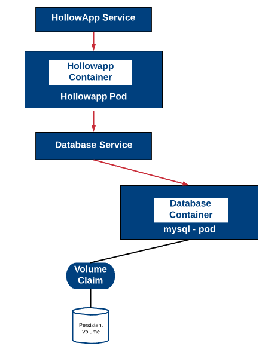

# Kubernetes Persistent Volumes

> Containers are often times short lived. They might scale based on need, and will redeploy when issues occur.
> This functionality is welcomed, but sometimes we have state to worry about and state is not meant to be short lived.
> Kubernetes persistent volumes can help to resolve this discrepancy.

## Table of Contents

<!-- START doctoc generated TOC please keep comment here to allow auto update -->
<!-- DON'T EDIT THIS SECTION, INSTEAD RE-RUN doctoc TO UPDATE -->


- [The Theory](#the-theory)
  - [Persistent Volumes](#persistent-volumes)
  - [Persistent Volume Claims](#persistent-volume-claims)
  - [Claim Policies](#claim-policies)
- [In Action](#in-action)
- [References](#references)

<!-- END doctoc generated TOC please keep comment here to allow auto update -->


## The Theory

### Persistent Volumes

Persistent Volumes are simply a piece of storage in your cluster. Similar to how you have a disk resource in a server, a persistent volume provides storage resources for objects in the cluster. At the most simple terms you can think of a PV as a disk drive. It should be noted that this storage resource exists independently from any pods that may consume it. Meaning, that if the pod dies, the storage should remain intact assuming the claim policies are correct. Persistent Volumes are provisioned in two ways, Statically or Dynamically.
Static Volumes – A static PV simply means that some k8s administrator provisioned a persistent volume in the cluster and it’s ready to be consumed by other resources.
Dynamic Volumes – In some circumstances a pod could require a persistent volume that doesn’t exist. In those cases it is possible to have k8s provision the volume as needed if storage classes were configured to demonstrate where the dynamic PVs should be built. This post will focus on static volumes for now.

### Persistent Volume Claims
    
Pods that need access to persistent storage, obtain that access through the use of a Persistent Volume Claim. A PVC, binds a persistent volume to a pod that requested it.
When a pod wants access to a persistent disk, it will request access to the claim which will specify the size , access mode and/or storage classes that it will need from a Persistent Volume. Indirectly the pods get access to the PV, but only through the use of a PVC.

### Claim Policies

We also reference claim policies earlier. A Persistent Volume can have several different claim policies associated with it including:
Retain – When the claim is deleted, the volume remains.
Recycle – When the claim is deleted the volume remains but in a state where the data can be manually recovered.
Delete – The persistent volume is deleted when the claim is deleted.
The claim policy (associated at the PV and not the PVC) is responsible for what happens to the data on when the claim has been deleted.


## In Action

<div align="center"></div>

<!-- AUTO-GENERATED-CONTENT:START (CODE:src=labs/mysql-pv.yaml) -->
<!-- The below code snippet is automatically added from labs/mysql-pv.yaml -->
```yaml
---
apiVersion: v1
kind: PersistentVolume
metadata:
  name: mysqlvol
spec:
  storageClassName: manual
  capacity:
    # Size of the volume
    storage: 10Gi
  accessModes:
    # Type of access
    - ReadWriteOnce
  hostPath:
    # host location
    path: "/mnt/data"
```
<!-- AUTO-GENERATED-CONTENT:END -->

<!-- AUTO-GENERATED-CONTENT:START (CODE:src=labs/mysql-pvc.yaml) -->
<!-- The below code snippet is automatically added from labs/mysql-pvc.yaml -->
```yaml
---
apiVersion: v1
kind: PersistentVolumeClaim
metadata:
  name: mysqlvol
spec:
  storageClassName: manual
  accessModes:
    - ReadWriteOnce
  resources:
    requests:
      storage: 10Gi
```
<!-- AUTO-GENERATED-CONTENT:END -->

<!-- AUTO-GENERATED-CONTENT:START (CODE:src=labs/mysql-deployment.yaml) -->
<!-- The below code snippet is automatically added from labs/mysql-deployment.yaml -->
```yaml
---
apiVersion: apps/v1
kind: Deployment
metadata:
  name: hollowdb
  labels:
    app: hollowdb
spec:
  replicas: 1
  selector:
    matchLabels:
      app: hollowdb
  strategy:
    type: Recreate
  template:
    metadata:
      labels:
        app: hollowdb
    spec:
      containers:
        - name: mysql
          image: eshanks16/hollowdb-mysql:v4
          imagePullPolicy: Always
          ports:
            - containerPort: 3306
          volumeMounts:
            - name: mysqlstorage
              mountPath: /var/lib/mysql
      volumes:
        - name: mysqlstorage
          persistentVolumeClaim:
            claimName: mysqlvol
```
<!-- AUTO-GENERATED-CONTENT:END -->

<!-- AUTO-GENERATED-CONTENT:START (CODE:src=labs/mysql-service.yaml) -->
<!-- The below code snippet is automatically added from labs/mysql-service.yaml -->
```yaml
---
apiVersion: v1
kind: Service
metadata:
  name: hollowdb
spec:
  ports:
    - name: mysql
      port: 3306
      targetPort: 3306
      protocol: TCP
  selector:
    app: hollowdb
```
<!-- AUTO-GENERATED-CONTENT:END -->


## References

- [Kubernetes - Persistent Volumes](https://theithollow.com/2019/03/04/kubernetes-persistent-volumes/)
- [Kubernetes Volumes 2: Understanding Persistent Volume (PV) and Persistent Volume Claim (PVC)](https://www.youtube.com/watch?v=OulmwTYTauI)
