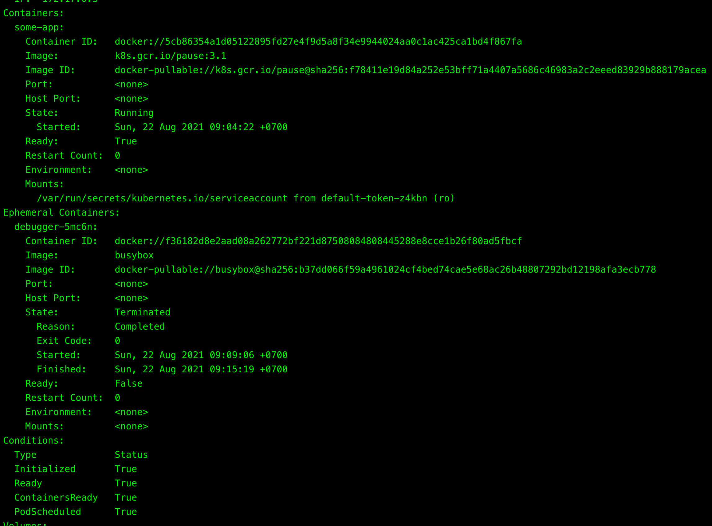
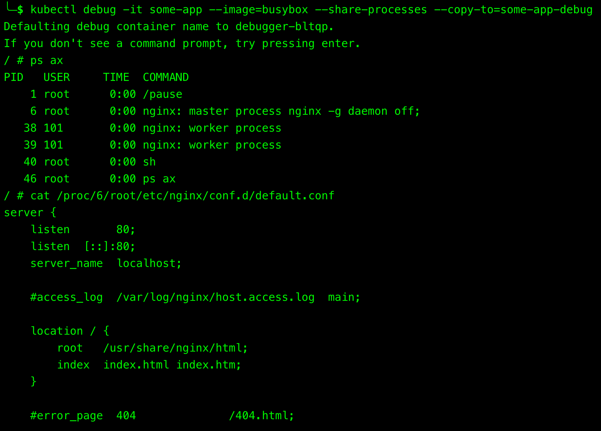

# Table of Contents {#table-of-contents .TOC-Heading}

[Feature Gates 1](#feature-gates)

[\$ minikube start \--driver=virtualbox
\--feature-gates=EphemeralContainers=true
1](#minikube-start---drivervirtualbox---feature-gatesephemeralcontainerstrue)

[Debugging With An Ephemeral Debug Container
1](#debugging-with-an-ephemeral-debug-container)

[\$ kubectl run some-app \--image=k8s.gcr.io/pause:3.1 \--restart=Never
2](#kubectl-run-some-app---imagek8s.gcr.iopause3.1---restartnever)

[\$ kubectl debug -it some-app \--image=busybox \--target=some-app
2](#kubectl-debug--it-some-app---imagebusybox---targetsome-app)

[\$ kubectl describe pod some-app 2](#kubectl-describe-pod-some-app)

[\$ kubectl get pods 2](#kubectl-get-pods)

[\$ kubectl delete pod some-app 2](#kubectl-delete-pod-some-app)

[Debugging Using A Copy Of The Pod
3](#debugging-using-a-copy-of-the-pod)

[\$ kubectl run some-app \--image=nginx \--restart=Never
3](#kubectl-run-some-app---imagenginx---restartnever)

[\$ kubectl debug -it some-app \--image=busybox \--share-processes
\--copy-to=some-app-debug
3](#kubectl-debug--it-some-app---imagebusybox---share-processes---copy-tosome-app-debug)

[\$ kubectl get pods 3](#kubectl-get-pods-1)

[\$ kubectl get pod some-app-debug -o json \| jq
.spec.shareProcessNamespace
3](#kubectl-get-pod-some-app-debug--o-json-jq-.spec.shareprocessnamespace)

[\$ kubectl delete pod some-app some-app-debug
3](#kubectl-delete-pod-some-app-some-app-debug)

[Debugging CrashLoopBackOff Application
4](#debugging-crashloopbackoff-application)

[\$ kubectl run crashing-app \--image=mikephammer/crashloopbackoff
4](#kubectl-run-crashing-app---imagemikephammercrashloopbackoff)

[\$ kubectl get pods 4](#kubectl-get-pods-2)

[\$ kubectl debug crashing-app -it \--copy-to=crashing-app-debug
\--container=crashing-app \-- sh
4](#kubectl-debug-crashing-app--it---copy-tocrashing-app-debug---containercrashing-app----sh)

[\$ kubectl get pods 4](#kubectl-get-pods-3)

[Debugging Cluster Node 4](#debugging-cluster-node)

[\$ kubectl get nodes 4](#kubectl-get-nodes)

[\$ kubectl debug node/minikube -it \--image=ubuntu
4](#kubectl-debug-nodeminikube--it---imageubuntu)

[root\@minikube:/\# chroot /host 4](#rootminikube-chroot-host)

[Alternative Debugging Approaches 5](#alternative-debugging-approaches)

[References 5](#references)

# Feature Gates

Kubernetes alpha/experimental features can be enabled or disabled by the
***\--feature-gates*** flag on the minikube start command.

## \$ minikube start \--driver=virtualbox \--feature-gates=EphemeralContainers=true

# Debugging With An Ephemeral Debug Container

***kubectl debug*** allows us to debug running pods.

It injects special type of container called ***EphemeralContainer***
into problematic pod.

## \$ kubectl run some-app \--image=k8s.gcr.io/pause:3.1 \--restart=Never

pod/some-app created

## \$ kubectl debug -it some-app \--image=busybox \--target=some-app

Defaulting debug container name to debugger-5mc6n.

If you don\'t see a command prompt, try pressing enter.

/ \# id

uid=0(root) gid=0(root) groups=10(wheel)

-   ***-it*** these two parameters are responsible for keeping the stdin
    open and allocating a TTY.

-   ***\--image*** is the name of the image for the ephemeral container.

-   ***\--target*** lets the ephemeral container targeting processes in
    the defined container name inside a pod.

## \$ kubectl describe pod some-app

{width="7.479615048118985in"
height="4.881944444444445in"}

## \$ kubectl get pods

NAME READY STATUS RESTARTS AGE

some-app 1/1 Running 0 46s

## \$ kubectl delete pod some-app

pod \"some-app\" deleted

# Debugging Using A Copy Of The Pod

## \$ kubectl run some-app \--image=nginx \--restart=Never

pod/some-app created

## \$ kubectl debug -it some-app \--image=busybox \--share-processes \--copy-to=some-app-debug

{width="4.330708661417323in"
height="4.156581364829396in"}

-   ***\--share-processes***: when used with ***\--copy-to***, enable
    **process namespace sharing** in the copy.

-   ***\--copy-to***: create a copy of the target pod with this name.

## \$ kubectl get pods

NAME READY STATUS RESTARTS AGE

some-app 1/1 Running 0 13m

some-app-debug 1/2 NotReady 0 12m

New debug pod has 2 containers in comparison to the original one as it
also includes the ephemeral container.

## \$ kubectl get pod some-app-debug -o json \| jq .spec.shareProcessNamespace

true

To verify whether the process sharing is allowed in a pod.

## \$ kubectl delete pod some-app some-app-debug

pod \"some-app\" deleted

pod \"some-app-debug\" deleted

# Debugging CrashLoopBackOff Application

A common situation is that application keeps crashing upon container
start, making it difficult to debug as there's not enough time to get
shell session into the container and run some troubleshooting commands.

In this case, the solution would be to create a new container with
different entry point (or command), which would stop the application
from crashing immediately and allowing us to perform debugging.

## \$ kubectl run crashing-app \--image=mikephammer/crashloopbackoff

pod/crashing-app created

## \$ kubectl get pods

NAME READY STATUS RESTARTS AGE

crashing-app 0/1 CrashLoopBackOff 4 2m41s

## \$ kubectl debug crashing-app -it \--copy-to=crashing-app-debug \--container=crashing-app \-- sh

If you don\'t see a command prompt, try pressing enter.

/ \# id

uid=0(root) gid=0(root)
groups=0(root),1(bin),2(daemon),3(sys),4(adm),6(disk),10(wheel),11(floppy),20(dialout),26(tape),27(video)

1.  Create a copy of "crashing-app" pod.

2.  Change the command of "crashing-app" container to "sh".

## \$ kubectl get pods

NAME READY STATUS RESTARTS AGE

crashing-app 0/1 CrashLoopBackOff 5 6m12s

crashing-app-debug 1/1 Running 1 114s

# Debugging Cluster Node

***kubectl debug*** allows for debugging of nodes by creating pod that
will run on specified node with node\'s root filesystem mounted.

This essentially acts as an SSH connection into node, considering that
we can even use ***chroot*** to get access to host binaries.

## \$ kubectl get nodes

NAME STATUS ROLES AGE VERSION

minikube Ready control-plane,master 3m20s v1.20.2

## \$ kubectl debug node/minikube -it \--image=ubuntu

Creating debugging pod node-debugger-minikube-97sz5 with container
debugger on node minikube.

If you don\'t see a command prompt, try pressing enter.

root\@minikube:/\# ls /host

Users data etc init lib64 linuxrc mnt preloaded.tar.lz4 root sbin sys
usr

bin dev home lib libexec media opt proc run srv tmp var

## root\@minikube:/\# chroot /host

sh-5.0\# pwd

/

sh-5.0\# ls

Users data etc init lib64 linuxrc mnt preloaded.tar.lz4 root sbin sys
usr

bin dev home lib libexec media opt proc run srv tmp var

-   ***chroot***: run commands with a special root directory.

-   When get attached to the pod, we use ***chroot /host*** to break out
    of jail and gain full access to the host.

# Alternative Debugging Approaches

If, for whatever reason, enabling ephemeral containers is not an option,
then try to:

-   Use debug version of application image which would include
    troubleshooting tools.

-   Temporarily change pod's container's command directive to stop it
    from crashing.

# References

<https://towardsdatascience.com/the-easiest-way-to-debug-kubernetes-workloads-ff2ff5e3cc75>

<https://kubernetes.io/docs/tasks/debug-application-cluster/debug-running-pod/>
