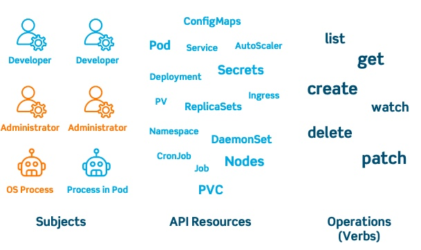

# RBAC Authorization

> Role-based access control (RBAC) is a method of regulating access to computer or network resources based on the roles of individual users within an enterprise.

## Table of Contents

<!-- START doctoc generated TOC please keep comment here to allow auto update -->
<!-- DON'T EDIT THIS SECTION, INSTEAD RE-RUN doctoc TO UPDATE -->

- [Key Concepts](#key-concepts)
- [References](#references)

<!-- END doctoc generated TOC please keep comment here to allow auto update -->

## Key Concepts

- **Verbs**: This is a set of operations that can be executed on resources. There are many verbs, but they’re all Create, Read, Update, or Delete (also known as CRUD).
- **API Resources**: These are the objects available on the clusters. They are the pods, services, nodes, PersistentVolumes and other things that make up Kubernetes.
- **Subjects**: These are the objects (users, groups, processes) allowed access to the API, based on Verbs and Resources.

  
   
  <em>The types of Role Based Access Control used by Kubernetes</em>

These three concepts combine into giving a user permission to execute certain operations on a set of resources by using Roles (which connects API Resources and Verbs) and RoleBindings (connecting subjects like users, groups and service accounts to Roles).

Users are authenticated using one or more authentication modes. These include client certificates, passwords, and various tokens. After this, each user action or request on the cluster is authorized against the rules assigned to a user through roles.

There are two kinds of users: service accounts managed by Kubernetes, and normal users. These normal users come from an identity store outside Kubernetes. This means that accessing Kubernetes with multiple users, or even multiple roles, is something that needs to be carefully thought out. Which identity source will you use? Which access control mode most suits you? Which attributes or roles should you define? For larger deployments, it’s become standard to give each app a dedicated service account and launch the app with it. Ideally, each app would run in a dedicated namespace, as it’s fairly easy to assign roles to namespaces.

Kubernetes does lend itself to securing namespaces, granting only permissions where needed so users don’t see resources in their authorized namespace for isolation. It also limits resource creation to specific namespaces, and applies quotas.

Many organizations take this one step further and lock down access even more, so only tooling in their CI/CD pipeline can access Kubernetes, via service accounts. This locks out real, actual humans, as they’re expected to interact with Kubernetes clusters only indirectly.

## References

- [Kubernetes RBAC: Giving Users Access](https://platform9.com/blog/the-gorilla-guide-to-kubernetes-in-the-enterprise-chapter-4-putting-kubernetes-to-work/)
- [Demystifying RBAC in Kubernetes](https://www.cncf.io/blog/2018/08/01/demystifying-rbac-in-kubernetes/)
- [Using RBAC Authorization](https://kubernetes.io/docs/reference/access-authn-authz/rbac/)
