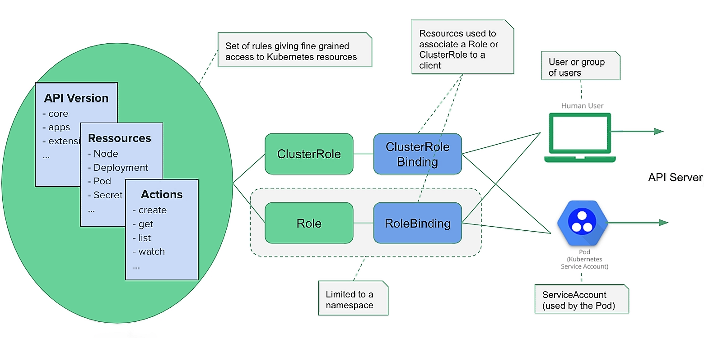

# Kubernetes Service Accounts

<div align="center"></div>
<br />

> A `ServiceAccount` is used by containers running in a `Pod`,
> to communicate with the API server of the Kubernetes cluster.


## Table of Contents

<!-- START doctoc generated TOC please keep comment here to allow auto update -->
<!-- DON'T EDIT THIS SECTION, INSTEAD RE-RUN doctoc TO UPDATE -->


- [Accessing the API Server From a `Pod`](#accessing-the-api-server-from-a-pod)
- [Using the Namespace Default `ServiceAccount`](#using-the-namespace-default-serviceaccount)
- [Using a Custom `ServiceAccount`](#using-a-custom-serviceaccount)
- [Main Takeaways](#main-takeaways)
- [References](#references)

<!-- END doctoc generated TOC please keep comment here to allow auto update -->


## Accessing the API Server From a `Pod`

A lot of applications that run in the cluster,
need to communicate with the API server.
Among them are the processes running within
the Control Plane (scheduler, controller manager, proxy, etc.),
as well as all the applications that
need to perform some form of administration for the cluster.

For example, some applications might need to know:
- The status of the cluster's nodes.
- The namespaces available.
- The Pods running in the cluster, or in a specific namespace.

To communicate with the API server,
a Pod uses a ServiceAccount containing an authentication token.
Roles (e.g. the right to list all the Pods within a given namespace),
or ClusterRole (e.g. the right to read all the Secrets within the entire cluster),
can then be bound to this ServiceAccount.
Respectively with a RoleBinding or a ClusterRoleBinding,
so the ServiceAccount is authorized to perform those actions.

From the outside of the cluster:
the API server can be accessed using the end point specified in the kubeconfig file (`~/.kube/config` by default).
As an example, if you use a DigitalOcean Managed Kubernetes,
the end point is something like https://b703a4fd-0d56-4802-a354-ba2c2a767a77.k8s.ondigitalocean.com

From the inside of the cluster:
the API server can be accessed using the dedicated service of type ClusterIP named kubernetes.
This service is there by default and automatically recreated if it is deleted by error.

```bash
$ kubectl get services
NAME         TYPE        CLUSTER-IP   EXTERNAL-IP   PORT(S)   AGE
kubernetes   ClusterIP   10.96.0.1    <none>        443/TCP   65m
```

With the correct rights (more on that later),
listing the Pods in the default namespace can be done from a Pod with this simple GET request.


## Using the Namespace Default `ServiceAccount`

Each namespace has a default ServiceAccount, named `default`.
We can verify this with the following command:

```bash
$ kubectl get serviceaccounts --all-namespaces | grep default
default                default                              1         73m
kube-node-lease        default                              1         73m
kube-public            default                              1         73m
kube-system            default                              1         73m
kubernetes-dashboard   default                              1         73m
```

Let's inspect the ServiceAccount named default of the default namespace
(this will be pretty much the same for the default ServiceAccount of another namespace).

```bash
$ kubectl get serviceaccount default --output=yaml
apiVersion: v1
kind: ServiceAccount
metadata:
  creationTimestamp: "2019-12-02T09:00:41Z"
  name: default
  namespace: default
  resourceVersion: "335"
  selfLink: /api/v1/namespaces/default/serviceaccounts/default
  uid: 45fcb6c2-2ff4-4a0d-ac15-4fa2b0b75fa4
secrets:
- name: default-token-frgh2
```

We can see here that a Secret is provided to this ServiceAccount.
Let's have a closer look at this one:

```bash
$ kubectl get secret default-token-frgh2 --output=yaml
apiVersion: v1
data:
  ca.crt: LS0tLS1CRUdJTiBDRVJUSUZJQ0FURS0tLS0tCk1JSUM1ekNDQWMrZ0F3SUJBZ0lCQVRBTkJna3Foa2lHOXcwQkFRc0ZBREFWTVJNd0VRWURWUVFERXdwdGFXNXAKYTNWaVpVTkJNQjRYRFRFNE1EZ3dNekEyTkRVd09Gb1hEVEk0TURnd01UQTJORFV3T0Zvd0ZURVRNQkVHQTFVRQpBeE1LYldsdWFXdDFZbVZEUVRDQ0FTSXdEUVlKS29aSWh2Y05BUUVCQlFBRGdnRVBBRENDQVFvQ2dnRUJBT2NFCnhTRXQ5OTV0UVdqemJHZVlsb2ZidGRiSSthWno0RkRoQmlCUkVSU3pYQ1pEQVd4aWlQdzNkYWIyV0NmRkFHMmwKaWx4UnlBandFZSs0ZXkzdDBGbXBQUDhPRzJNdVdqUk1zMmJHREdhNVUvUFdEcTFHRk1lMDY3emZYTXRzUVh3QQpTMlI1YVlyWFZlb0loU29wdWZ4d1RiNXF1VkdicnUzOG9XNnBOVmsybHk4MVljQkJQaENRby9ua3MzaExhRXh6Ck93T3BwdlFZZzAxdy90RkZ2VnRoRHRxY2RzNWV0bXN3SzlXOWFNMUQvc3YvRDFMVnc5dXdwNGdOVWlYS2VTQ1oKTS9rUWowTWREQTZCWUNRRWN6STFCZEpYQjdTSklQSm16T3U2QTEramdMc3BWWExjc0UvbXRQcHkwMmozRW5udwpvS1VkZjljNU0vQTlNb0cyL0UwQ0F3RUFBYU5DTUVBd0RnWURWUjBQQVFIL0JBUURBZ0trTUIwR0ExVWRKUVFXCk1CUUdDQ3NHQVFVRkJ3TUNCZ2dyQmdFRkJRY0RBVEFQQmdOVkhSTUJBZjhFQlRBREFRSC9NQTBHQ1NxR1NJYjMKRFFFQkN3VUFBNElCQVFCQjgydC9rMjVrMlR5M0RiT2VhdUtsQ2hFNng2dWFwQ0NKUkZMR0ViQmVpRVo3YkRFVgpxL29ZbEJsS2FtSmdVaXRnNkVOMUhqUllTNEZvWnpjN3hEU2hSMG1wQWpHU0U3eTZkTS95RzlCMmFzMWZYeFlWCi9PUllZNFczQlZUdFBZelBUSUlOTTVrV0s1aDJzV0lEQVVySFJucVpUOUxtaXRXUXNscys0dzBYTFp6bGhKNjEKUHhhM0U0ajM1cEZzc2wxdlZsb0VwWW1NckNnU1ZXL1BWaGJsYUpMYkYyY3JVUThlMGZOV1ZVYmdGNWMrNzNzMwpiUFVGOWYxM3VLS0x3UVpncVFRQURwbHArejR0YU92S3BYUzNaVm8yMGhGTzRmVVkvSGtldGQ3OSttcUs2NldRCjREZ3pENktmSXR1dG1KNWJIRE1SREplNXNYQmUvcmF2WVYzTQotLS0tLUVORCBDRVJUSUZJQ0FURS0tLS0tCg==
  namespace: ZGVmYXVsdA==
  token: ZXlKaGJHY2lPaUpTVXpJMU5pSXNJbXRwWkNJNkltNXJTM1ZQZUVGd2EwTnRNakpyYmpoM2FrZGZZbUpSUTNVellqRnpTVlJqTTFoeFIyMUNZbkE0YmswaWZRLmV5SnBjM01pT2lKcmRXSmxjbTVsZEdWekwzTmxjblpwWTJWaFkyTnZkVzUwSWl3aWEzVmlaWEp1WlhSbGN5NXBieTl6WlhKMmFXTmxZV05qYjNWdWRDOXVZVzFsYzNCaFkyVWlPaUprWldaaGRXeDBJaXdpYTNWaVpYSnVaWFJsY3k1cGJ5OXpaWEoyYVdObFlXTmpiM1Z1ZEM5elpXTnlaWFF1Ym1GdFpTSTZJbVJsWm1GMWJIUXRkRzlyWlc0dFpuSm5hRElpTENKcmRXSmxjbTVsZEdWekxtbHZMM05sY25acFkyVmhZMk52ZFc1MEwzTmxjblpwWTJVdFlXTmpiM1Z1ZEM1dVlXMWxJam9pWkdWbVlYVnNkQ0lzSW10MVltVnlibVYwWlhNdWFXOHZjMlZ5ZG1salpXRmpZMjkxYm5RdmMyVnlkbWxqWlMxaFkyTnZkVzUwTG5WcFpDSTZJalExWm1OaU5tTXlMVEptWmpRdE5HRXdaQzFoWXpFMUxUUm1ZVEppTUdJM05XWmhOQ0lzSW5OMVlpSTZJbk41YzNSbGJUcHpaWEoyYVdObFlXTmpiM1Z1ZERwa1pXWmhkV3gwT21SbFptRjFiSFFpZlEuaXBwcndBZXlOZnVYR21EcGN1TWk3aUdvTHNneUh0R09hNm5ZdElNYWpQZmFuemNxUmFlcU1GS1gwd25oblFqXy1KWHQwQjA2M1lqX2loRGVmZE5PdTE4bTZOVUoxVXFic3l6am15S3YyLUZxMGt0VWxlTzhZMGhjclJrWmhoZTBYc2FBeVg1TFVNUHgtaGdwWHdxVW9wTURqQ1VXYVZwQlhxNlNtZVp4cDN1TXVNcWFrWV9nTTRMX3hTNEcwZkVQRm1TWU1jeE1IMTJ3WWstZW9XalNMSlhwX1NOQmViZnZiUGdXdHNuOENxdi1JZDNvMlkzZWl2ZnF4RzJpdGxrdERJaTh4WElBVzJJYm1GUExOSjVuQnBERFhNdEs4STIxZmNBOU9lbFJ6cjZwSERndHBRS01LcHpGRWh3aE9zN0pTWEtXak1udVFjOG1jdjFWUGQwSnBB
kind: Secret
metadata:
  annotations:
    kubernetes.io/service-account.name: default
    kubernetes.io/service-account.uid: 45fcb6c2-2ff4-4a0d-ac15-4fa2b0b75fa4
  creationTimestamp: "2019-12-02T09:00:41Z"
  name: default-token-frgh2
  namespace: default
  resourceVersion: "332"
  selfLink: /api/v1/namespaces/default/secrets/default-token-frgh2
  uid: b07164c5-4875-44cd-88c3-f4c1104d5e2d
type: kubernetes.io/service-account-token
```

There are several key/value pairs under the data key of this Secret.
For readability, I've shortened the value of the ca.crt and token values, basically:

- `ca.crt` is the Base64 encoding of the cluster certificate.
- `namespace` is the Base64 encoding of the current namespace (default).
- `token` is the Base64 encoding of the JWT used to authenticate against the API server.

Note: JSON Web Token (JWT) is an open standard (RFC 7519),
that defines a compact and self-contained way for securely transmitting information between parties as a JSON object.
This information can be verified and trusted because it is digitally signed.

Let's focus on the token.
Once decoded (using base64 -d on Linux, or base64 -D on MacOS),
we can easily get the payload of this JWT from the command line,
or an online service like jwt.io.

This payload has the following format:

```json
{
  "iss": "kubernetes/serviceaccount",
  "kubernetes.io/serviceaccount/namespace": "default",
  "kubernetes.io/serviceaccount/secret.name": "default-token-frgh2",
  "kubernetes.io/serviceaccount/service-account.name": "default",
  "kubernetes.io/serviceaccount/service-account.uid": "45fcb6c2-2ff4-4a0d-ac15-4fa2b0b75fa4",
  "sub": "system:serviceaccount:default:default"
}
```

We can see the ServiceAccount it is linked to,
the namespace it exists in,
and some other internal information.


## Using a Custom `ServiceAccount`


## Main Takeaways


## References

- [Kubernetes Tips: Using a ServiceAccount](https://medium.com/better-programming/k8s-tips-using-a-serviceaccount-801c433d0023)
