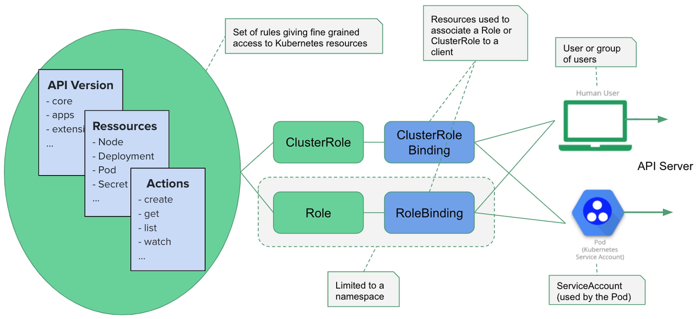

# Kubernetes Service Accounts

<div align="center"></div>
<br />

> A `ServiceAccount` is used by containers running in a `Pod`,
> to communicate with the API server of the Kubernetes cluster.


## Table of Contents

<!-- START doctoc generated TOC please keep comment here to allow auto update -->
<!-- DON'T EDIT THIS SECTION, INSTEAD RE-RUN doctoc TO UPDATE -->


- [Accessing the API Server From a `Pod`](#accessing-the-api-server-from-a-pod)
- [Using the Namespace Default `ServiceAccount`](#using-the-namespace-default-serviceaccount)
- [Using a Custom `ServiceAccount`](#using-a-custom-serviceaccount)
- [Main Takeaways](#main-takeaways)
- [References](#references)

<!-- END doctoc generated TOC please keep comment here to allow auto update -->


## Accessing the API Server From a `Pod`

A lot of applications that run in the cluster,
need to communicate with the API server.
Among them are the processes running within
the Control Plane (scheduler, controller manager, proxy, etc.),
as well as all the applications that
need to perform some form of administration for the cluster.

For example, some applications might need to know:
- The status of the cluster's nodes.
- The namespaces available.
- The Pods running in the cluster, or in a specific namespace.

To communicate with the API server,
a Pod uses a ServiceAccount containing an authentication token.
Roles (e.g. the right to list all the Pods within a given namespace),
or ClusterRole (e.g. the right to read all the Secrets within the entire cluster),
can then be bound to this ServiceAccount.
Respectively with a RoleBinding or a ClusterRoleBinding,
so the ServiceAccount is authorized to perform those actions.

From the outside of the cluster:
the API server can be accessed using the end point specified in the kubeconfig file (`~/.kube/config` by default).
As an example, if you use a DigitalOcean Managed Kubernetes,
the end point is something like https://b703a4fd-0d56-4802-a354-ba2c2a767a77.k8s.ondigitalocean.com

From the inside of the cluster:
the API server can be accessed using the dedicated service of type ClusterIP named kubernetes.
This service is there by default and automatically recreated if it is deleted by error.

```bash
$ kubectl get services
NAME         TYPE        CLUSTER-IP   EXTERNAL-IP   PORT(S)   AGE
kubernetes   ClusterIP   10.96.0.1    <none>        443/TCP   65m
```

With the correct rights (more on that later),
listing the Pods in the default namespace can be done from a Pod with this simple GET request.


## Using the Namespace Default `ServiceAccount`


## Using a Custom `ServiceAccount`


## Main Takeaways


## References

- [Kubernetes Tips: Using a ServiceAccount](https://medium.com/better-programming/k8s-tips-using-a-serviceaccount-801c433d0023)
