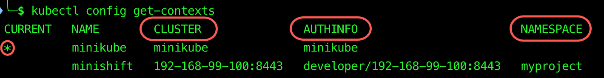
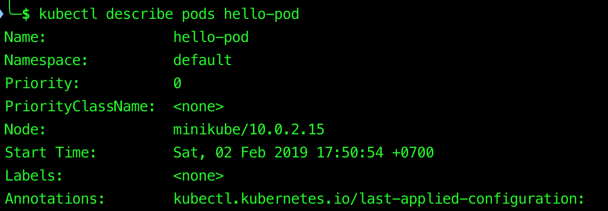
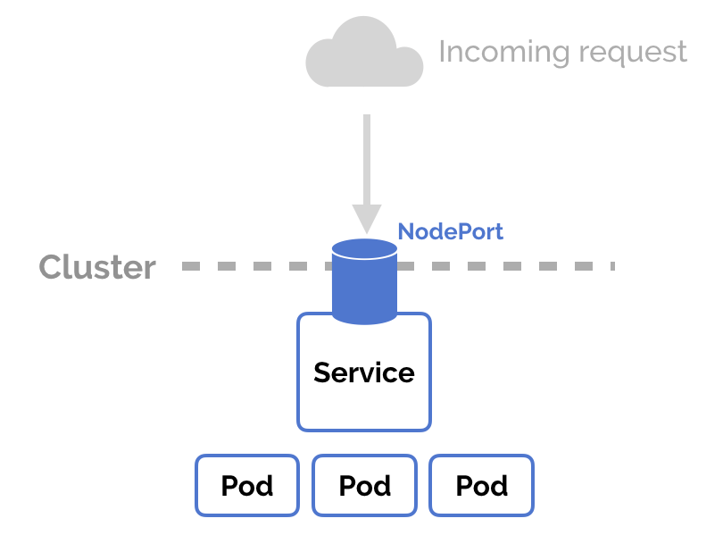

# Learning Kubernetes


## Next Steps

- [Work Queue](01-work-queue)
- [Config Maps and Secrets](02-config-maps-and-secrets)
- [Learning Google Kubernetes Engine](https://github.com/hieuvp/learning-gke)

## Table of Contents

<!-- START doctoc generated TOC please keep comment here to allow auto update -->
<!-- DON'T EDIT THIS SECTION, INSTEAD RE-RUN doctoc TO UPDATE -->


- [minikube](#minikube)
  - [Dashboard](#dashboard)
  - [Service](#service)
- [kubectl](#kubectl)
  - [Version](#version)
  - [Context](#context)
  - [Imperative Object Configuration](#imperative-object-configuration)
  - [Declarative Object Configuration](#declarative-object-configuration)
  - [Viewing, Finding Resources](#viewing-finding-resources)
  - [Interacting with Running Pods](#interacting-with-running-pods)
- [Kubernetes Architecture](#kubernetes-architecture)
  - [Nodes](#nodes)
    - [Master Components](#master-components)
      - [apiserver](#apiserver)
      - [Cluster Store](#cluster-store)
      - [Controller](#controller)
      - [Scheduler](#scheduler)
    - [Node Components](#node-components)
      - [Kubelet](#kubelet)
      - [Container Engine](#container-engine)
      - [kube-proxy](#kube-proxy)
  - [The Cluster](#the-cluster)
  - [Persistent Volumes](#persistent-volumes)
  - [Pods](#pods)
    - [Pod Lifecycle Phases](#pod-lifecycle-phases)
    - [Container Probes](#container-probes)
  - [Labels](#labels)
  - [Label Selectors](#label-selectors)
    - [Equality-based Selectors](#equality-based-selectors)
    - [Set-based Selectors](#set-based-selectors)
  - [Services](#services)
    - [Service Discovery](#service-discovery)
      - [Using Environment Variables](#using-environment-variables)
      - [Using DNS (Strongly Recommended)](#using-dns-strongly-recommended)
    - [Service Types](#service-types)
  - [Ingress](#ingress)
  - [Deployments](#deployments)
    - [Replication Controllers](#replication-controllers)
    - [Replica Sets and Deployments](#replica-sets-and-deployments)
- [Kubernetes Objects](#kubernetes-objects)
  - [Deploying Pods via Replication Controller](#deploying-pods-via-replication-controller)
    - [hello-pod.yaml](#hello-podyaml)
    - [hello-rc.yaml](#hello-rcyaml)
  - [Creating a Service](#creating-a-service)
    - [hello-svc.yaml](#hello-svcyaml)
    - [Endpoints](#endpoints)
  - [Creating a Deployment](#creating-a-deployment)
    - [hello-deploy.yaml](#hello-deployyaml)
    - [`maxUnavailable`](#maxunavailable)
    - [`maxSurge`](#maxsurge)
    - [`minReadySeconds`](#minreadyseconds)
    - [Rolling Updates](#rolling-updates)
    - [Rollbacks](#rollbacks)
- [References](#references)

<!-- END doctoc generated TOC please keep comment here to allow auto update -->


## [minikube](https://github.com/kubernetes/minikube)

> Run Kubernetes locally.

### Dashboard

```bash
minikube dashboard
```

<div align="center"></div>

### Service

- List the URLs for the services in your local cluster

```bash
minikube service list
```


- Access a service exposed via a [`NodePort`](#service-types)

	- `--url`: Display the Kubernetes service URL in the CLI instead of opening it in the default browser.

```bash
minikube service [--namespace NAMESPACE] [--url] NAME
```


## kubectl

> [kubectl](https://kubernetes.io/docs/reference/kubectl/overview/) is a command line interface for running commands against Kubernetes clusters.

- **Syntax**: `kubectl [command] [TYPE] [NAME] [flags]`.

- **Kubectl Reference Docs**: [https://kubernetes.io/docs/reference/generated/kubectl/kubectl-commands](https://kubernetes.io/docs/reference/generated/kubectl/kubectl-commands).

### Version

- Check for the Kubernetes **client** and **server** version information

```bash
kubectl version
```


### Context

> A [context](https://kubernetes.io/docs/concepts/configuration/organize-cluster-access-kubeconfig/#context) element in a `kubeconfig` file is used to group access parameters under a convenient name. Each context has three parameters: **Cluster**, **Namespace**, and **User**.

```bash
kubectl config get-contexts
```



- Display the `current-context`

```bash
kubectl config current-context
```

- Set the default context to `minikube`

```bash
kubectl config use-context minikube
```

### [Imperative Object Configuration](https://kubernetes.io/docs/concepts/overview/object-management-kubectl/#imperative-object-configuration)

- Create the objects defined in a configuration file

```bash
kubectl create --filename nginx.yaml
```

- Delete the objects defined in two configuration files

```bash
kubectl delete --filename nginx.yaml --filename redis.yaml
```

- Update the objects defined in a configuration file by **overwriting the live configuration**

```bash
kubectl replace --filename nginx.yaml
```

### [Declarative Object Configuration](https://kubernetes.io/docs/concepts/overview/object-management-kubectl/#declarative-object-configuration)

Process all object configuration files in the `configs/` directory, and **create** or **patch** the **live objects**. You can first `diff` to see what changes are going to be made, and then `apply`.

```bash
kubectl diff --filename configs/
kubectl apply --filename configs/
```

### [Viewing, Finding Resources](https://kubernetes.io/docs/reference/kubectl/cheatsheet/#viewing-finding-resources)

```bash
kubectl get nodes
```


```bash
kubectl get pods
```


<br />

- Print a detailed description of the selected resources, including related resources such as events or controllers

```bash 
kubectl describe nodes minikube
kubectl describe pods hello-pod
```



### [Interacting with Running Pods](https://kubernetes.io/docs/reference/kubectl/cheatsheet/#interacting-with-running-pods)

```bash
kubectl logs gitea-pod
```


## Kubernetes Architecture

### Nodes

<div align="center">
  
  <br />
  <em>A node is the smallest unit of computing hardware in Kubernetes</em>
  <br />
  <em>It is a representation of a single machine in your cluster</em>
</div>

<br />
<br />

<div align="center">
  
  <br />
  <em>Big Picture View</em>
</div>

#### [Master Components](https://kubernetes.io/docs/concepts/overview/components/#master-components)

**The cluster's control plane**, master components make global decisions about the cluster (e.g. scheduling), and detecting and responding to cluster events (e.g. starting up a new pod when a `ReplicationController`'s `replicas` field is unsatisfied).

<div align="center"></div>

##### apiserver

- Expose the Kubernetes API.
- The front-end for the Kubernetes control plane and the only component we speak to.

##### Cluster Store

- Persistent storage.
- Use [`etcd`](https://github.com/etcd-io/etcd/blob/master/Documentation/docs.md), an open source distributed **key-value** store.
- The **source of truth** for the cluster.

##### Controller

- [`kube-controller-manager`](https://kubernetes.io/docs/concepts/overview/components/#kube-controller-manager) is a component on the master that runs controllers such as
**Node Controller**, **Replication Controller**, **Endpoints Controller**, **Service Account Controller**, **Token Controller**.

- [`cloud-controller-manager`](https://kubernetes.io/docs/concepts/overview/components/#cloud-controller-manager) runs controllers that interact with the underlying cloud providers such as
**Node Controller**, **Route Controller**, **Service Controller**, **Volume Controller**.

##### Scheduler

- Watch newly created pods that have no node assigned, and select a node for them to run on.

#### [Node Components](https://kubernetes.io/docs/concepts/overview/components/#node-components)

**The workers a.k.a. minions**, maintaining running pods and providing the Kubernetes runtime environment.

<div align="center"></div>

##### Kubelet

- An agent that runs on each node in the cluster. It makes sure that containers are running in a pod.
- Take a set of **PodSpecs** that are provided through various mechanisms and ensure that the containers described in those **PodSpecs** are running and healthy.
- It does not manage containers which were not created by Kubernetes.

##### Container Engine

- Responsible for running containers (e.g. pulling images, starting containers, stopping containers).
- Support several runtimes: [Docker](https://www.docker.com/), [containerd](https://containerd.io/), [cri-o](https://cri-o.io/), [rktlet](https://github.com/kubernetes-incubator/rktlet) and any implementation of the [Kubernetes CRI (Container Runtime Interface)](https://github.com/kubernetes/community/blob/master/contributors/devel/sig-node/container-runtime-interface.md).

##### kube-proxy

- Enable the Kubernetes service abstraction by maintaining network rules on the host and performing connection forwarding.

### The Cluster

<div align="center"></div>

### Persistent Volumes

> [Persistent Volumes](https://kubernetes.io/docs/concepts/storage/persistent-volumes/) provide a file system that can be mounted to the cluster, without being associated with any particular node.

<div align="center"></div>

### Pods

<div align="center">
  
  <br />
  <em>Pod is the atomic unit of scheduling</em>
</div>
<br />

<div align="center"></div>

- Kubernetes does not run containers directly, instead it wraps one or more containers into a higher-level structure called a [Pod](https://kubernetes.io/docs/concepts/workloads/pods/pod-overview/).
- Any containers in the same pod will share the same resources:
	- **Network**: same IP address and port space, can find each other via `localhost`.
	- **Storage**: shared volumes.
	- **Context**: is a set of Linux namespaces, cgroups, and potentially other facets of isolation.
- Because pods are scaled up and down as a unit, all containers in a pod must scale together, regardless of their individual needs.

#### [Pod Lifecycle Phases](https://kubernetes.io/docs/concepts/workloads/pods/pod-lifecycle/#pod-phase)

> Pods are mortal. They are born and when they die, they are not resurrected.

<div align="center"></div>

- **`Pending`**: The pod has been accepted by the Kubernetes system, but one or more of the container images has not been created. This includes time before being scheduled as well as time spent downloading images over the network.
- **`Running`**: The pod has been bound to a node, and all of the containers have been created. At least one container is still running, or is in the process of starting or restarting.
- **`Succeeded`**: All containers in the pod have terminated in success, and will not be restarted.
- **`Failed`**: All containers in the pod have terminated, and at least one container has terminated in failure.

<div align="center"></div>

<br />

- **`Unknown`**: For some reason the state of the pod could not be obtained, typically due to an error in communicating with the host of the pod.
- **`Completed`**: The pod has run to completion as there's nothing to keep it running (e.g. Completed Jobs).
- **`CrashLoopBackOff`**: This means that one of the containers in the pod has exited unexpectedly, and perhaps with a non-zero error code even after restarting due to [restart policy](https://kubernetes.io/docs/concepts/workloads/pods/pod-lifecycle/#restart-policy).

#### [Container Probes](https://kubernetes.io/docs/concepts/workloads/pods/pod-lifecycle/#container-probes)

> A [**Probe**](https://kubernetes.io/docs/reference/generated/kubernetes-api/v1.13/#probe-v1-core) is a diagnostic performed periodically by the **kubelet** on a container.

- **`livenessProbe`**: Indicate whether the container is running (alive).
If the **livenessProbe** fails, the **kubelet** kills the container, and the container is subjected to its restart policy.

- **`readinessProbe`**: Indicate whether the container is ready to service requests.
If the **readinessProbe** fails, the endpoints controller removes the pod's IP address from the endpoints of all services that match the pod.

### [Labels](https://kubernetes.io/docs/concepts/overview/working-with-objects/labels/)

- **Labels** are key/value pairs which are attached to objects (e.g. Pod, ReplicationController, Service,...).
- **Labels** are intended to be used to specify identifying attributes of objects that are meaningful and relevant to users.
- **Labels** can be attached to objects at creation time and subsequently added and modified at any time.

```bash
kubectl get pods --show-labels
```


### [Label Selectors](https://kubernetes.io/docs/concepts/overview/working-with-objects/labels/#label-selectors)

- Labels do not provide uniqueness, generally we expect many objects to carry the same label(s).
- Via a **Label Selector**, the client/user can identify a set of objects.
- The **Label Selector** is the core grouping primitive in Kubernetes.

#### [Equality-based Selectors](https://kubernetes.io/docs/concepts/overview/working-with-objects/labels/#equality-based-requirement)

- Equality: **`=`**, **`==`**.
- Inequality: **`!=`**.

```bash
kubectl get pods --show-labels --selector version=v1,zone=prod
```


#### [Set-based Selectors](https://kubernetes.io/docs/concepts/overview/working-with-objects/labels/#set-based-requirement)

- **`in`**, **`notin`**.
- **`exists`**: only the key identifier e.g. **`version`**, **`!version`**.

```bash
kubectl get pods --show-labels --selector 'version,zone in (dev, prod)'
```


### Services

- A [Service](https://kubernetes.io/docs/concepts/services-networking/service/) is an abstraction which defines a logical set of pods and a policy by which to access them - sometimes called a `micro-service`.
- Services provide reliable network endpoint: IP address, DNS (Domain Name System) name, port.
- Services enable **external traffic exposure**, **load balancing** and **service discovery** for pods.

<div align="center">
  
  <br />
  <em>Exposing Pods to external traffic</em>
  <br />
  <em>Load balancing traffic across multiple Pods</em>
</div>

<br />

<div align="center">
  
  <br />
  <em>Communication inside the Cluster</em>
</div>

<br />

<div align="center">
  
  <br />
  <em>Service selects Pods based on Labels and load balances between them</em>
</div>

#### Service Discovery

[Service Discovery](https://kubernetes.io/docs/concepts/services-networking/service/#discovering-services) is the process of figuring out how to connect to a service. Kubernetes supports two primary modes of finding a service.

##### Using [Environment Variables](https://kubernetes.io/docs/concepts/services-networking/service/#environment-variables)

- When a pod is run on a node, the **kubelet** adds a set of environment variables for each active service, `{SVCNAME}_SERVICE_HOST`, `{SVCNAME}_SERVICE_PORT`,...
- For example, a service named `redis-master` produces the following environment variables:

```dotenv
REDIS_MASTER_SERVICE_HOST=10.0.0.11
REDIS_MASTER_SERVICE_PORT=6379
REDIS_MASTER_PORT=tcp://10.0.0.11:6379
REDIS_MASTER_PORT_6379_TCP=tcp://10.0.0.11:6379
REDIS_MASTER_PORT_6379_TCP_PROTO=tcp
REDIS_MASTER_PORT_6379_TCP_PORT=6379
REDIS_MASTER_PORT_6379_TCP_ADDR=10.0.0.11
```

- Any service that a pod wants to access must be created before the pod itself, or else the environment variables will not be populated. DNS does not have this restriction.

##### Using [DNS](https://kubernetes.io/docs/concepts/services-networking/service/#dns) (Strongly Recommended)

- The DNS server watches the Kubernetes API for new services and creates a set of DNS records for each.
- For example, if you have a service called `my-service` in a Kubernetes namespace called `my-ns`, a DNS record for `my-service.my-ns` is created:
	- Pods which exist in the `my-ns` namespace should be able to find it by simply doing a name lookup for `my-service`.
	- Pods which exist in other namespaces must qualify the name as `my-service.my-ns`.

#### [Service Types](https://kubernetes.io/docs/concepts/services-networking/service/#publishing-services-service-types)

- **`ClusterIP`** (default): Expose the service on a cluster-internal IP. Choosing this value makes the service only reachable from within the cluster.

- **`NodePort`**: Expose a public port on your worker node (the `NodePort`) and use the public IP address of the worker node to access your service in the cluster publicly from the internet.

<div align="center"></div>

<br />

A `ClusterIP` service, to which the `NodePort` service will route, is automatically created. The assigned `NodePort` is publicly exposed in the **kube-proxy** settings of each worker node in the cluster. Every worker node starts listening on the assigned `NodePort` for incoming requests for the service. To access the service from the internet, you can use the public IP address of any worker node that was assigned during cluster creation and the `NodePort` in the format `<NodeIP>:<NodePort>`.

<div align="center"></div>

The public IP address of the worker node is not permanent. When a worker node is removed or re-created, a new public IP address is assigned to the worker node. 

You can use the `NodePort` service for testing the public access for your app or when public access is needed for a short amount of time only. When you require a stable public IP address and more availability for your service, expose your app by using a `LoadBalancer` service or [`Ingress`](#ingress).

- **`LoadBalancer`**: Expose the service externally using a cloud provider's load balancer. `NodePort` and `ClusterIP` services, to which the external load balancer will route, are automatically created.

<div align="center">
  
  <br />
  <em>This is typically heavily dependent on the cloud provider</em>
</div>

<br />

Every time you want to expose a service to the outside world, you have to create a new `LoadBalancer` and get an IP address.

### [Ingress](https://kubernetes.io/docs/concepts/services-networking/ingress/)

> An API object that manages external access to the [services](#services) in a cluster, typically HTTP.

<div align="center"></div>

- You configure access by creating a collection of rules that define which inbound connections reach which services.
- For example, you might want to send requests to `example.com/api/v1/` to an `api-v1` service, and requests to `example.com/api/v2/` to the `api-v2` service. With an **`Ingress`**, you can easily set this up without creating a bunch of LoadBalancers or exposing each service on the node.

**`NodePort`** and **`LoadBalancer`** let you expose a service by specifying that value in the service's `type`. **`Ingress`**, on the other hand, is a completely independent resource to your service. You declare, create and destroy it separately to your services.

### Deployments

<div align="center">
  
  <br />
  <em>Pods are usually managed by one more layer of abstraction</em>
</div>

#### [Replication Controllers](https://kubernetes.io/docs/concepts/workloads/controllers/replicationcontroller/)

> **ReplicationController** is the original form of **replication** in Kubernetes, it is being replaced by [**Deployment**](#replica-sets-and-deployments).

- A `ReplicationController` is a structure that enables you to easily **create** multiple pods, then make sure that number of pods always exists. If a pod does crash, the `ReplicationController` replaces it.
- `ReplicationControllers` also provide other benefits, such as the ability to **scale** the number of pods, and to **update** / **delete** multiple pods with a single command.

#### [Replica Sets](https://kubernetes.io/docs/concepts/workloads/controllers/replicaset/) and [Deployments](https://kubernetes.io/docs/concepts/workloads/controllers/deployment/)

- `ReplicaSets` are declared in essentially the same way as [**`ReplicationControllers`**](#replication-controllers), except that they have more options for the [**LabelSelector**](https://kubernetes.io/docs/reference/generated/kubernetes-api/v1.13/#labelselector-v1-meta) (`matchLabels`, `matchExpressions`).
- The major difference is that the [`rolling-update`](https://kubernetes.io/docs/tasks/run-application/rolling-update-replication-controller/) command works with **`ReplicationController`**, but won't work with a `ReplicaSet`. This is because `ReplicaSets` are meant to be used as the backend for `Deployments`.

> **Deployments** are intended to replace [**ReplicationControllers**](#replication-controllers). They provide the same **replication** functions (through **ReplicaSets**) and also the ability to **roll out changes** and **roll them back** if necessary.


## Kubernetes Objects

> [Kubernetes Objects](https://kubernetes.io/docs/concepts/overview/working-with-objects/kubernetes-objects/#understanding-kubernetes-objects) are persistent entities in the Kubernetes system. Kubernetes uses these entities to represent the state of your cluster.

- Kubernetes API Reference Docs: [https://kubernetes.io/docs/reference/generated/kubernetes-api/v1.13/](https://kubernetes.io/docs/reference/generated/kubernetes-api/v1.13/)

### Deploying Pods via [Replication Controller](https://kubernetes.io/docs/concepts/workloads/controllers/replicationcontroller/)

<div align="center">
  
  <br />
  <em>Pods are not typically run directly in Kubernetes</em>
  <br />
  <em>Instead, we should define via higher level objects to manage our Pods</em>
</div>

#### [hello-pod.yaml](hello/hello-pod.yaml)

```yaml
# Pod v1 core
# https://kubernetes.io/docs/reference/generated/kubernetes-api/v1.13/#pod-v1-core
apiVersion: v1
kind: Pod

metadata:
  name: hello-pod
  labels:
    zone: prod
    version: v1

# PodSpec v1 core
# https://kubernetes.io/docs/reference/generated/kubernetes-api/v1.13/#podspec-v1-core
spec:
  containers:
    - name: hello-ctr
      image: nigelpoulton/pluralsight-docker-ci:latest
      ports:
        # Port to expose on the pod's IP address
        # https://kubernetes.io/docs/reference/generated/kubernetes-api/v1.13/#containerport-v1-core
        - containerPort: 8080
```

```bash
kubectl get pods
```


```bash
# Show details as well as the reason why
kubectl describe pods hello-pod
```

#### [hello-rc.yaml](hello/hello-rc.yaml)

```yaml
# ReplicationController v1 core
# https://kubernetes.io/docs/reference/generated/kubernetes-api/v1.13/#replicationcontroller-v1-core
apiVersion: v1
kind: ReplicationController

metadata:
  name: hello-rc

# ReplicationControllerSpec v1 core
# https://kubernetes.io/docs/reference/generated/kubernetes-api/v1.13/#replicationcontrollerspec-v1-core
spec:

  # The number of desired replicas, defaults to 1
  replicas: 10

  # Selector is a label query over pods that should match the Replicas count
  # If Selector is empty, it is defaulted to the labels present on the Pod template
  selector:
    app: hello-world

  # PodTemplateSpec v1 core
  # https://kubernetes.io/docs/reference/generated/kubernetes-api/v1.13/#podtemplatespec-v1-core
  template:

    metadata:
      labels:
        app: hello-world

    spec:
      containers:
        - name: hello-ctr
          image: nigelpoulton/pluralsight-docker-ci:latest
          ports:
            - containerPort: 8080
```

```bash
watch --interval 1 kubectl get pods
```


```bash
kubectl get rc
kubectl get replicationcontrollers
```


### Creating a Service

- **`nodePort`**: This setting makes the service visible outside the Kubernetes cluster by the node's IP address and the port number declared in this property.
- **`port`**: Expose the service on the specified port internally within the cluster.
- **`targetPort`**: This is the port on the pod that the request gets sent to.

<br />

[Expose](https://kubernetes.io/docs/reference/generated/kubectl/kubectl-commands#expose) a resource as a new Kubernetes service

```bash
kubectl expose rc hello-rc --name=hello-svc --target-port=8080 --type=NodePort
```


```bash
kubectl describe svc hello-svc
```


```bash
kubectl delete svc hello-svc
```


#### [hello-svc.yaml](hello/hello-svc.yaml)

```yaml
# Service v1 core
# https://kubernetes.io/docs/reference/generated/kubernetes-api/v1.13/#service-v1-core
apiVersion: v1
kind: Service

metadata:
  name: hello-svc
  labels:
    app: hello-world

# ServiceSpec v1 core
# https://kubernetes.io/docs/reference/generated/kubernetes-api/v1.13/#servicespec-v1-core
spec:
  type: NodePort

  ports:
    - port: 8080
      nodePort: 30001

      # The IP protocol for this port
      # Support TCP, UDP, and SCTP, default is TCP
      protocol: TCP

  selector:
    app: hello-world
```

```bash
kubectl get svc
kubectl get services
```


#### Endpoints

<div align="center"></div>

<br />

```bash
kubectl get ep
kubectl get endpoints
```


```bash
kubectl describe ep hello-svc
```


### Creating a Deployment

<div align="center">
  
  <br />
  <em>Deployments manage ReplicaSets, ReplicaSets manage Pods</em>
</div>

#### [hello-deploy.yaml](hello/hello-deploy.yaml)

```yaml
# Deployment v1 apps
# https://kubernetes.io/docs/reference/generated/kubernetes-api/v1.13/#deployment-v1-apps
apiVersion: apps/v1
kind: Deployment

metadata:
  name: hello-deploy

# DeploymentSpec v1 apps
# https://kubernetes.io/docs/reference/generated/kubernetes-api/v1.13/#deploymentspec-v1-apps
spec:

  replicas: 10

  # LabelSelector v1 meta
  # https://kubernetes.io/docs/reference/generated/kubernetes-api/v1.13/#labelselector-v1-meta
  # Existing ReplicaSets whose pods are selected by this will be the ones affected by this deployment
  # It must match the pod template's labels
  selector:
    matchLabels:
      app: hello-world

  # PodTemplateSpec v1 core
  # https://kubernetes.io/docs/reference/generated/kubernetes-api/v1.13/#podtemplatespec-v1-core
  template:

    metadata:
      labels:
        app: hello-world

    spec:
      containers:
        - name: hello-ctr
          image: nigelpoulton/pluralsight-docker-ci:latest
          ports:
            - containerPort: 8080
```

```bash
kubectl get deploy
kubectl get deployments
```


```bash
kubectl describe deploy hello-deploy
```


```bash
kubectl get rs
kubectl get replicasets
```


```bash
kubectl describe rs hello-deploy-5577b79544
```


```bash
kubectl get pods
```


#### `maxUnavailable`

> The maximum number of pods that can be unavailable during the update.

- This cannot be `0` if [`maxSurge`](#maxsurge) is `0`.
- `maxUnavailable: 1` means that there will be at most 1 pod unavailable during the update process.

#### `maxSurge`

> The maximum number of pods that can be scheduled above the desired number of pods.

- This cannot be `0` if [`maxUnavailable`](#maxunavailable) is `0`.
- `maxSurge: 1` means that if `replicas: 3` there will be at most `4` pods during the update process.

#### `minReadySeconds`

> Minimum number of seconds for which a newly created pod should be **ready** without any of its container crashing, for it to be considered **available**.

<div align="center"></div>

<br />

- Default to `0`, pod will be considered **available** as soon as it is **ready**.
- If leave this field empty, the service maybe unavailable during the update process because the pods are not ready yet.

#### Rolling Updates

```diff
- image: nigelpoulton/pluralsight-docker-ci:latest
+ image: nigelpoulton/pluralsight-docker-ci:edge
```

```yaml
minReadySeconds: 10

# DeploymentStrategy v1 apps
# https://kubernetes.io/docs/reference/generated/kubernetes-api/v1.13/#deploymentstrategy-v1-apps
# The deployment strategy to use to replace existing pods with new ones
strategy:

# Can be "Recreate" or "RollingUpdate"
# Default is "RollingUpdate"
type: RollingUpdate

# RollingUpdateDeployment v1 apps
# https://kubernetes.io/docs/reference/generated/kubernetes-api/v1.13/#rollingupdatedeployment-v1-apps
# Present only if DeploymentStrategyType = RollingUpdate
rollingUpdate:

  # Value can be an absolute number (e.g. 5) or a percentage of desired pods (e.g. 10%)
  # Default to 25%
  maxUnavailable: 1
  maxSurge: 1
```

<div align="center"></div>

<br />

```bash
kubectl apply --filename hello-deploy.yaml --record
kubectl rollout history deployment hello-deploy
```


```bash
kubectl rollout status deployment hello-deploy
```


```bash
kubectl get rs
```


#### Rollbacks

<div align="center"></div>

<br />

```bash
kubectl rollout undo deployment hello-deploy --to-revision 1
```


```bash
kubectl rollout status deployment hello-deploy
```


```bash
kubectl get rs
```


## References
- [Running Kubernetes Locally via Minikube](https://kubernetes.io/docs/setup/minikube/)
- [Kubernetes 101: Pods, Nodes, Containers, and Clusters](https://medium.com/google-cloud/kubernetes-101-pods-nodes-containers-and-clusters-c1509e409e16)
- [Kubernetes 110: Your First Deployment](https://medium.com/google-cloud/kubernetes-110-your-first-deployment-bf123c1d3f8)
- [Kubernetes 120: Networking Basics](https://medium.com/google-cloud/kubernetes-120-networking-basics-3b903f13093a)
- [Kubernetes Ingress 101: NodePort, Load Balancers, and Ingress Controllers](https://blog.getambassador.io/kubernetes-ingress-nodeport-load-balancers-and-ingress-controllers-6e29f1c44f2d)
- [Kubernetes Ingress with Nginx Example](https://matthewpalmer.net/kubernetes-app-developer/articles/kubernetes-ingress-guide-nginx-example.html)
- [Port, TargetPort, and NodePort in Kubernetes](https://matthewpalmer.net/kubernetes-app-developer/articles/kubernetes-ports-targetport-nodeport-service.html)
- [Kubernetes Replication Controller, Replica Set and Deployments: Understanding replication options](https://www.mirantis.com/blog/kubernetes-replication-controller-replica-set-and-deployments-understanding-replication-options/)
- [Rolling Updates with Kubernetes Deployments](https://tachingchen.com/blog/kubernetes-rolling-update-with-deployment/)
- [Kubernetes Bootcamp](https://kubernetesbootcamp.github.io/kubernetes-bootcamp/)
- [Getting Started with Kubernetes](https://www.pluralsight.com/courses/getting-started-kubernetes)
