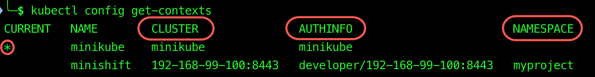
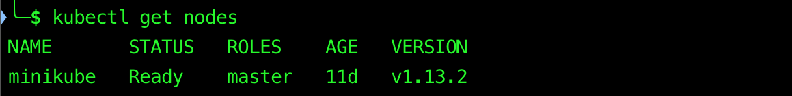
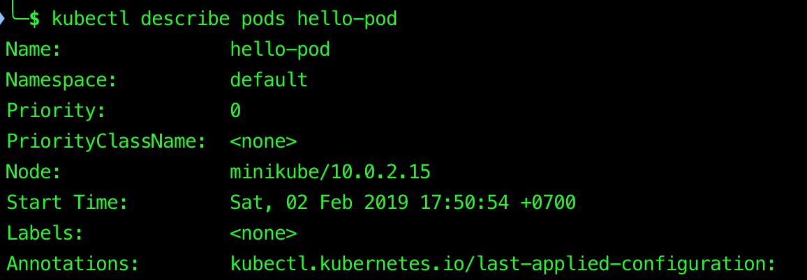
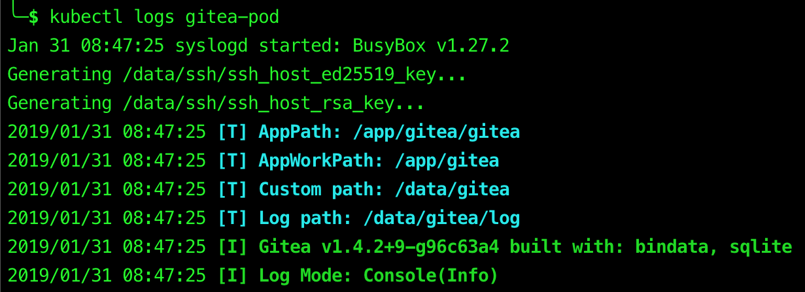

# kubectl

> `kubectl` is a command line interface for running commands against Kubernetes clusters.

## Table of Contents

<!-- START doctoc generated TOC please keep comment here to allow auto update -->
<!-- DON'T EDIT THIS SECTION, INSTEAD RE-RUN doctoc TO UPDATE -->

- [Version](#version)
- [Context](#context)
- [Imperative Object Configuration](#imperative-object-configuration)
- [Declarative Object Configuration](#declarative-object-configuration)
- [Viewing, Finding Resources](#viewing-finding-resources)
- [Interacting with Running Pods](#interacting-with-running-pods)
- [References](#references)

<!-- END doctoc generated TOC please keep comment here to allow auto update -->

## Version

```bash
$ kubectl version
Client Version: version.Info{Major:"1", Minor:"16", GitVersion:"v1.16.2", GitCommit:"c97fe5036ef3df2967d086711e6c0c405941e14b", GitTreeState:"clean", BuildDate:"2019-10-15T23:42:50Z", GoVersion:"go1.12.10", Compiler:"gc", Platform:"darwin/amd64"}
Server Version: version.Info{Major:"1", Minor:"16", GitVersion:"v1.16.2", GitCommit:"c97fe5036ef3df2967d086711e6c0c405941e14b", GitTreeState:"clean", BuildDate:"2019-10-15T19:09:08Z", GoVersion:"go1.12.10", Compiler:"gc", Platform:"linux/amd64"}
```

```bash
$ kubectl version --short
Client Version: v1.16.2
Server Version: v1.16.2
```

## Context

<div align="center">
  <div>
    A <strong>Context</strong> element in a <strong>kubeconfig</strong> file is
    used to group access parameters under a convenient name.
  </div>
  <div>
    Each <strong>Context</strong> has three parameters:
    <strong>Cluster</strong>, <strong>User</strong>, and <strong>Namespace</strong>.
  </div>
</div>

<br />

```bash
kubectl config get-contexts
```



<br />

```bash
# Display the "current-context"
$ kubectl config current-context
minikube
```

```bash
# Set the default context to "minikube"
$ kubectl config use-context minikube
Switched to context "minikube".
```

## [Imperative Object Configuration](https://kubernetes.io/docs/concepts/overview/working-with-objects/object-management/#imperative-object-configuration)

```bash
# Create the objects defined in a configuration file
$ kubectl create --filename nginx.yaml
```

```bash
# Delete the objects defined in two configuration files
$ kubectl delete --filename nginx.yaml --filename redis.yaml
```

```bash
# Update the objects defined in a configuration file
# by overwriting the live configuration
$ kubectl replace --filename nginx.yaml
```

## [Declarative Object Configuration](https://kubernetes.io/docs/concepts/overview/working-with-objects/object-management/#declarative-object-configuration)

Process all object configuration files in the `configs/` directory,
and `create` or `patch` the **live objects**.
You can first `diff` to see what changes are going to be made, and then `apply`.

```bash
kubectl diff --filename configs/
kubectl apply --filename configs/
```

## [Viewing, Finding Resources](https://kubernetes.io/docs/reference/kubectl/cheatsheet/#viewing-finding-resources)

```bash
kubectl get nodes
```



<br />

```bash
kubectl get pods
```


<br />

```bash
# Print a detailed description of the selected resources,
# including related resources such as events or controllers
$ kubectl describe nodes minikube
$ kubectl describe pods hello-pod
```



## [Interacting with Running Pods](https://kubernetes.io/docs/reference/kubectl/cheatsheet/#interacting-with-running-pods)

```bash
kubectl logs gitea-pod
```



## References

- [Kubectl Reference Docs](https://kubernetes.io/docs/reference/generated/kubectl/kubectl-commands)
